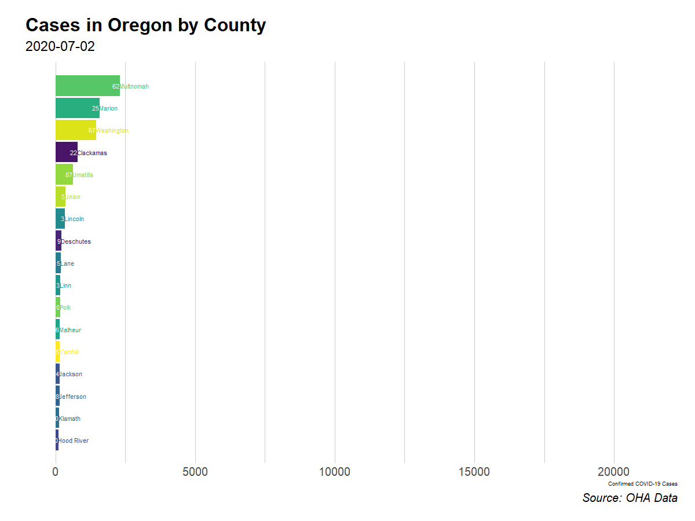

```{r setup, include=FALSE}
knitr::opts_chunk$set(echo = TRUE, message=FALSE, warning = FALSE)
library(tidyverse)
```

# Oregon COVID data

I wanted to create a self-updating visualization of [the data on COVID-19 in the state of Oregon provided by OHA](https://govstatus.egov.com/OR-OHA-COVID-19).  I still have yet to do that but decided to [build this one to visualize the New York Times data](https://s8.sytes.net/shiny/COVID19/).

<iframe width="100%" height="80%" src="https://rwwalker.shinyapps.io/COVID19/"> </iframe>

There is a [separate page of daily maps](https://rww.science/r/covid-maps/).  Oregon reports a set of daily snapshots while progression requires ingesting new data each day so  I began tracking it March 20; the process of scraping it is detailed in [a separate file](https://rww.science/r/covid-scraping/).  This updates, expands, and consolidates two previous posts [here](https://rww.science/2020/03/21/covid-19-in-oregon/) and [here](https://rww.science/2020/03/24/covid-19-county-maps-for-oregon/).  A few cautionary notes.  First, these are cumulative case counts that are almost certainly incomplete.  Second, there is reason to believe that the death numbers may also be incomplete because it is dangerous to police and first responders are spread thinly.

This post is current as of August 24, 2020; this first bit of R code loads the current data from my github.


```{r, eval=FALSE}
library(tigris)
library(rgdal)
library(htmltools)
library(viridis) 
library(sf)
library(ggrepel)
library(ggthemes)
library(gganimate)
library(patchwork)
library(hrbrthemes)
library(widgetframe)
load(url(paste0("https://github.com/robertwwalker/rww-science/raw/master/content/R/COVID/data/OregonCOVID",Sys.Date(),".RData")))
```

```{r, echo=FALSE, message=FALSE, warning=FALSE}
rm(list=ls())
library(tigris)
library(rgdal)
library(htmltools)
library(viridis) 
library(sf)
library(ggrepel)
library(ggthemes)
library(gganimate)
library(patchwork)
library(hrbrthemes)
library(widgetframe); library(here)
library(magrittr)
load(paste0(here(),"/content/R/COVID/data/OregonCOVID",Sys.Date(),".RData"))
load(paste0(here(),"/content/R/COVID/data/CountyMap.RData"))
```

Verifying, these data are current as of `r max(Oregon.COVID$Scraped.date)` according to the loaded dataset.

### A running commentary on the data

The central takeaway is that the underlying data reports are constantly changing over time.  They are reporting new and different quantities and this destroys the comparability of data.  Some of it can be reconstructed but much of it is only useful going forward and keeping the schema constant.  I hope that will happen at some point.

*2020-03-23 and before* It started with only three tables.  Then four, then five, adding footnotes and rearranging the data structures became common.  Until the data structures solidify, maintaining comparability, and feeding appropriate data to the visualization tool continue to pose challenges and require a fair amount of tweaking.

*2020-03-30* Footnotes for some entries appear newly today.  That's irritating because it changes the variable names.

*2020-03-31* The status of COVID patients and available hospital details were previously in one table but now were split into two parts.  The underlying auto-scraper required changes.

*2020-04-02* The status of COVID patients and available hospital details are pending in the report.  I have updated the rest.  This remains true as of April 5, 2020.  

*2020-04-08* It came back yesterday.

*2020-04-22* Negative tests for all counties and the total are listed as pending.  Resolved 04/23.  Combined in report, split up by me.

*2020-05-04* New version of header table with different labels.

*2020-05-05* Non-binary added as new classification.

*2020-05-11* Numbered footnotes change most of the variable names, code updated.

*2020-05-15* Numbered footnotes changed Cases to Cases1, code updated.

*2020-05-19* For strain on hospitals, Total was renamed to Total.staffed.

*2020-06-06* The state of Oregon has stopped reporting the full set of tables on weekends, switching instead to a report style.  Those aren't easily made to scrape because the doc titles are variable and the data is unformatted.  For now, I will skip Saturdays and had added a new weekend script to take the daily tables from .csv and merge them.  Only the graphics on testing, cases, and deaths are now a full times series; the rest are M-F 

*2020-07-03 through 2020-07-05* Apparently OHA took a long July 4 weekend.  The daily update data on tests and cases was produced, with all PENDING on one day that became missing.


# Summarising the County Data: Two Animations

## The March to Open


```{r, message=FALSE, warning=FALSE}
TabA <- rownames(table(Oregon.COVID$County))
TabB <- rownames(table(Oregon.COVID$Scraped.date))
Base.OR.County <- expand.grid(TabA,TabB, stringsAsFactors = FALSE)
names(Base.OR.County) <- c("County","Scraped.date")
Base.OR.County %<>% mutate(Scraped.date = as.Date(Scraped.date))
OR.County.COVID <- left_join(Base.OR.County, Oregon.COVID) %>% 
    mutate(Number.of.cases = replace_na(Number.of.cases, 0),
           Deaths = replace_na(Deaths, 0)) %>% 
    group_by(County) %>% 
    mutate(New.Cases = Number.of.cases - lag(Number.of.cases, order_by = Scraped.date), 
           New.Deaths = Deaths - lag(Deaths, order_by = Scraped.date), 
           Cases.MA7 = zoo::rollmean(New.Cases, 7, fill="extend"), 
           Deaths.MA7 = zoo::rollmean(New.Deaths, 7, fill="extend")) %>% 
    ungroup() %>% 
    group_by(Scraped.date) %>% 
    mutate(RankNC = rank(Cases.MA7, ties.method = "first"), RankC = rank(Number.of.cases, ties.method = "first")) %>% 
    ungroup()
```

##  A Horse Race

```{r HorseRace, eval=TRUE, message=FALSE, warning=FALSE, results='hide'}
# The Race to Open
OR.County.COVID %>% filter(RankC > 26) %>%
    ggplot(aes(x = RankC, y = Number.of.cases, fill=County, color=County, label=County)) +
    geom_col() +
    geom_text(hjust = "left") +
    geom_text(aes(label=as.character(New.Cases)), hjust = "right", color="white") +
    scale_x_discrete("") +
    coord_flip(clip="off") +
    scale_fill_viridis_d() +
    scale_color_viridis_d() +
    guides(fill=FALSE, color=FALSE) +
    labs(title='Cases in Oregon by County',
         subtitle='{frame_time}',
         caption='Source: OHA Data',
         y="Confirmed COVID-19 Cases") +
    hrbrthemes::theme_ipsum(plot_title_size = 32, subtitle_size = 24, caption_size = 20, base_size = 20) +
    gganimate::transition_time(Scraped.date) -> p1
  GGPA <- animate(p1, nframes = 200, end_pause = 50, width = 1200, height = 900)
  save_animation(GGPA, "./BarAnim.gif")
```




# A base map

To build a map to work from, I need a map library.  Load the `tigris` library then grab the map as an `sf` object; there is a `geom_sf` that makes them easy to work with.  Finally, I join the map to the data and build a tool tip to display.

```{r MapC, message=FALSE, warning=FALSE, results='hide'}
Names.AXIS <- names(table(counties.t$NAME))
Date.AXIS <- names(table(Oregon.COVID$date))
OR.COVG <- expand.grid(NAMES=Names.AXIS, date=Date.AXIS, stringsAsFactors = FALSE) %>% mutate(date = as.Date(date)) %>% left_join(., Oregon.COVID, by = c("NAMES" = "County", "date" = "date"))
Map.Me <- merge(counties.t,OR.COVG, by.x="NAME", by.y = "NAMES")
Res.1 <- Map.Me %>% 
  filter(date==max(date)) %>% 
  mutate(Percent.Positive = Number.of.cases / (Number.of.cases + Negative.test.results), 
         TTip = paste0("Percent Positive: ", Percent.Positive, "<br> Positive Tests: ", Number.of.cases, "<br> Negative Tests: ", Negative.test.results, "<br> Deaths: ", Deaths))
```


I will use a ggplot to build Oregon's map and fill it with case numbers. `geom_sf()` plots the geometry.  Labels for the counties, scheme the colors, and animate it by time to complete the graphic.  There is a  [separate page of daily maps](https://rww.science/r/covid/maps/). 

```{r, message=FALSE, warning=FALSE, eval=TRUE}
Anim1 <- Map.Me %>% 
  ggplot(., aes(geometry=geometry, fill=Number.of.cases, label=NAME, group=NAME)) + 
  geom_sf() +
  geom_label(stat = "sf_coordinates",
    min.segment.length = 0,
    colour = "white",
    segment.colour = "white",
    size = 3,
    box.padding = unit(0.05, "lines"))  + scale_fill_viridis_c() + theme_minimal() + labs(title="COVID-19 in Oregon", subtitle="{frame_time}", x="", y="", caption="Made with R, ggplot2, and gganimate by @PieRatio \n data: https://govstatus.egov.com/OR-OHA-COVID-19") + transition_time(date)
GGAnim <- animate(Anim1, end_pause=50, nframes=300, width = 1200, height = 900)
save_animation(GGAnim, file="./MapAnim.gif")
```


# Percent Positive for Oregon Counties

Divide the number of cases by the total number of tests completed and show them by county.

```{r, warning=FALSE, message=FALSE}
library(plotly)
Res1 <- Res.1 %>% 
  mutate(Percent.Positive = Number.of.cases / (Number.of.cases + Negative.test.results) ) %>%
#  filter(Negative.test.results > 10) %>% 
  ggplot(., aes(geometry=geometry, fill=Percent.Positive, label=NAME, text=Percent.Positive)) + 
   geom_sf() + 
   scale_fill_viridis_c(option = "A") + 
   theme_map() + 
   labs(title="Positive COVID-19 Tests in Oregon", subtitle=paste0(Sys.Date(),": \nonly counties with 10+ tests shown."), x="", y="", caption="Made with R, ggplot2, and ggrepel by @PieRatio \n data: https://govstatus.egov.com/OR-OHA-COVID-19", fill="Percent Positive")
GGP <- ggplotly(Res1)
frameWidget(GGP)
```

# Testing in Oregon

What is the cumulative status of testing?  These data, updated daily, render a count of all tests performed since January of 2020.  I am cutting it off to the start of June to make the labels easier to read.

```{r}
library(ggrepel); library(magrittr)
Oregon.Tests %<>% filter(Category!="Pending")
OR.Testing <- Oregon.Tests %>% group_by(date) %>% summarise(Total = sum(Outcome, na.rm=TRUE)) %>% ungroup() %>% filter(date > "2020-08-01")
Test1 <- Oregon.Tests %>% filter(date > "2020-08-01") %>%
  ggplot(.) + 
  aes(x=date, y=Outcome, fill=Category, label=Outcome) + 
  geom_col() + 
  geom_label(col="magenta", show.legend = FALSE, vjust=1, size=1.5) + 
  scale_fill_viridis_d() + 
#  scale_color_viridis_d() + 
  labs(title="Cumulative [since January 2020] COVID-19 Testing in Oregon \n Shown from August 1", y="Completed Tests", x="Date", subtitle="Total appears in black and white", caption = "data: https://govstatus.egov.com/OR-OHA-COVID-19") + 
  guides(fill=FALSE) +
  geom_label(data=OR.Testing, aes(x=date, y=Total, label=Total), fill="white", color="black", inherit.aes = FALSE, vjust = 0, size=1.5)
Test1
```

## A Second Look at Testing

We should worry about the degree to which tests are applied at all randomly; they are surely not.  As a result, what it means to calculate or break down probability based on having been tested is subject to so many important caveats that vary over time.  It is important to note that this is also cumulative test percentages/proportions.

```{r}
Test2 <- Oregon.Tests %>% 
  ggplot(.) + aes(x=date, y=Outcome, fill=Category, label=Outcome) + 
  geom_col(position = "fill") + 
  scale_fill_viridis_d() + 
  labs(title="Cumulative Outcomes of COVID-19 Testing in Oregon", y="Proportion of Tests", x="Date", caption = "data: https://govstatus.egov.com/OR-OHA-COVID-19 \n 04-22 Negative Tests Interpolated")
Test2
```

## A Better Look at This

Cumulative results are perhaps more informative when viewed alongside the marginal changes from day to day.  Here, I show the proportion of test outcomes just considering those test results reported for that day -- the daily distribution of test outcomes.

```{r, warning=FALSE, message=FALSE}
library(hrbrthemes); library(ggrepel); library(plotly)
MyDat <- Oregon.Tests %>%
  pivot_wider(., names_from = Category, values_from = Outcome) %>% 
  mutate(Positive.Chg = Positive - lag(Positive, order_by = date), 
         Negative.Chg = Negative - lag(Negative, order_by = date)) %>% 
  mutate(Total = Positive.Chg + Negative.Chg) %>% 
  mutate(Positive.Pct = round(Positive.Chg / Total, digits=3)) %>% 
  select(date, Positive.Chg, Negative.Chg, Positive.Pct) %>% 
  pivot_longer(., c(Negative.Chg, Positive.Chg), names_to = "Outcome", values_to = "Test.Changes")
MyDat2 <- MyDat %>% filter(Outcome=="Positive.Chg") %>% mutate(PPLab = Positive.Pct)
MyDat2$PPLab[MyDat2$date < Sys.Date()-4] <- NA
BaseP <- MyDat2 %>% 
  ggplot(., aes(x=date, y=Positive.Pct, text=Positive.Pct)) + 
  geom_line(color="magenta") + 
  geom_point() +
  guides(fill=FALSE, color=FALSE) +
  labs(title="Daily Distribution of Test Outcomes", subtitle="Percent of Positive Tests Shown") + theme_ft_rc()
RGP1 <- ggplotly(BaseP)
frameWidget(RGP1)
```

## Per-capita Testing by County

```{r, warning=FALSE, message=FALSE}
library(rvest); library(htmltools)
read_html("https://www.oregon-demographics.com/counties_by_population") %>% html_nodes("table") %>% .[1] %>% html_table(fill=TRUE) %>% data.frame() -> ORPOP
ORPOP[1:36,] %>% mutate(county = str_remove(County, " County"), Population = as.numeric(str_remove(Population,","))) -> ORPOP
Res.2 <- left_join(Res.1,ORPOP, by= c( "NAME" = "county")) %>% mutate(PerCap.Tests = (Number.of.cases + Negative.test.results) / Population)
R2GPM <- Res.2 %>% ggplot(., aes(geometry=geometry, fill=PerCap.Tests, label=NAME, text=TTip)) +
   geom_sf() + 
   scale_fill_viridis_c(option = "A") + 
   theme_map() + 
   labs(title="per capita COVID Testing in Oregon", subtitle=Sys.Date(), fill="per capita testing")
R2GPM3 <- ggplotly(R2GPM)
frameWidget(R2GPM3)
```

## New Cases: Moving Average

```{r}
OR.County.COVID <- Oregon.COVID %>% group_by(County) %>% mutate(New.Cases = Number.of.cases - lag(Number.of.cases, order_by = date), New.Deaths = Deaths - lag(Deaths, order_by = date), Cases.MA7 = zoo::rollmean(New.Cases, 7, fill=NA), Deaths.MA7 = zoo::rollmean(New.Deaths, 7, fill=NA))
OR.County.COVID.L <- OR.County.COVID %>% select(County, date, Cases.MA7, Deaths.MA7) %>% pivot_longer(cols=c(Cases.MA7,Deaths.MA7), names_to = "WhichVar", values_to = "Outcome") %>% mutate(WhichVar = str_remove(WhichVar, ".MA7"), date2 = as.Date("2020-05-20"))
GGP1 <- ggplot(OR.County.COVID.L, aes(x=date, y=Outcome, color=County, label=County, group=County)) + geom_line() + geom_text_repel(direction = "y", min.segment.length = 8) + scale_color_viridis_d() + guides(color=FALSE) + xlim(c(as.Date("2020-03-15"),as.Date("2020-06-15"))) +  hrbrthemes::theme_ipsum() + facet_wrap(vars(WhichVar), scales = "free_y") + transition_reveal(date)
animate(GGP1, end_pause = 50, nframes=150)
```


# Hospitalization Data for Oregon

How do positive cases and hospitalization relate?

```{r}
Hos1 <- OR.Hosp %>% 
  filter(Hospitalized.!="Total") %>% 
  ggplot(., aes(x=date, y=Number.of.cases,fill=Hospitalized.)) + 
  geom_col() + 
  scale_fill_ipsum() + 
  labs(x="Date", y="Number of COVID Positives", fill="Hospitalized?", title="Hospitalization and \n COVID-19 in Oregon") + 
  coord_flip()
Hos2 <- OR.Hosp %>% 
  filter(Hospitalized.!="Total") %>% 
  ggplot(., aes(x=date, y=Number.of.cases,fill=Hospitalized.)) + 
  geom_col(position="fill") + 
  scale_fill_ipsum() + 
  labs(x="Date", y="Number of COVID Positives", fill="Hospitalized?") + 
  coord_flip()
Hos1 + Hos2
```

# Age Data

How does this break down by age?  *I had to break this into two parts.  They changed the classification method on March 25, 2020.*

```{r}
OR.Ages1 <- OR.Ages %>% 
  filter(date < "2020-03-25")
Age1 <- OR.Ages1 %>% 
  ggplot(., aes(x=date, y=Number.of.cases, fill=Age.group)) + 
  geom_col() + 
  scale_fill_ipsum() + 
  labs(x="Date", y="Number of COVID-19 Positives") + 
  theme_economist() + 
  guides(fill=FALSE)
Age2 <- OR.Ages1 %>% ggplot(.) +
 aes(x = date, fill = Age.group, weight = Number.of.cases) +
 geom_bar(position = "fill") +
 scale_fill_ipsum() + labs(x="Date", y="Proportion of COVID-19 Positives") +
 theme_minimal()
Age1 + Age2
```

## The Revision

```{r}
OR.Ages1 <- OR.Ages %>% filter(date > "2020-03-24")
Age1 <- OR.Ages1 %>% 
  ggplot(., aes(x=date, y=Number.of.cases, fill=Age.group)) + geom_col() +
  scale_fill_viridis(discrete = TRUE) + labs(x="Date", y="Number of COVID-19 Positives") +
  theme_economist() + 
  theme(axis.text.x = element_text(size=8, angle=45)) +
  guides(fill=FALSE)
Age2 <- OR.Ages1 %>% ggplot(.) +
 aes(x = date, fill = Age.group, weight = Number.of.cases) +
 geom_bar(position = "fill") +
 scale_fill_viridis(discrete=TRUE) + labs(x="Date", y="Percent of COVID-19 Positives", fill="Age Group") +
 theme_economist() + 
 theme(axis.text.x = element_text(size=8, angle=45))
Age1 + Age2
```


# Males and Females

From the outset, there have been more cases reported for females than males.

```{r}
library(hrbrthemes)
OR.Sex.Reshape <- OR.Gender %>% 
  filter(Sex %in% c("Female","Male")) %>% 
  mutate(Actives = Cases - Deaths) %>% 
  select(-Cases) %>%  
  pivot_longer(., c(Actives,Deaths), names_to = "Outcome", values_to  = "Count")
OR.Sex.Reshape %>% 
  mutate(Category = paste(Sex, Outcome, sep=":")) %>% 
  filter(date > as.Date("2020-06-01")) %>%
  ggplot(., aes(x=date, y=Count, fill=Outcome)) + 
  geom_col(position="stack") + 
  scale_fill_ipsum() + 
  labs(x="Date", y="Cases", title="Cumulative Deaths and COVID-19 Cases in Oregon by Sex") +
  facet_wrap(vars(Sex))
```

I do not know to what extent that mirrors the general trend that men are more likely to suffer serious cases.  The death rate data seem to highlight that.

```{r}
OR.Gender %>% 
  filter(Sex%in%c("Male","Female")) %>% 
  mutate(CFR = Deaths / Cases) %>% 
  ggplot(., aes(x=date, y=CFR, color=Sex)) + 
  geom_point() + 
  geom_line() + 
  theme_ipsum_rc() +
  labs(x="Date", y="Case Fatality Ratio", title="Oregon's Cumulative Case Fatality Ratio by Sex")
```


# Analysis over Time

## Admissions

```{r}
OR.COVID.Strain %>% filter(COVID.19.Details=="COVID-19 admissions") %>% ggplot(., aes(x=date, y=COVID19.Patients)) + geom_point() + geom_line() + labs(title="COVID-19 Admissions", x="Date", y="Count", caption = "data: https://govstatus.egov.com/OR-OHA-COVID-19 \n By: @PieRatio") + theme_ipsum() + theme(axis.text.x = element_text(angle = 90))
```

## Hospital Capacity

```{r}
OR.Hospital.Caps %>% filter(date > "2020-03-28") %>%
  filter(Hospital.Capacity != "Ventilators") %>% 
  mutate(Hospital.Capacity = as.character(Hospital.Capacity)) %>%
  ggplot(.) +
    aes(x = date, fill = Type, colour = Type, y = Number) +
    geom_line() + geom_point() +
    hrbrthemes::scale_fill_ipsum() +
    hrbrthemes::scale_color_ipsum() +
    theme_ipsum() +
    facet_wrap(vars(Hospital.Capacity), scales = "free_y")
```

```{r}
OR.Hospital.Caps %>% filter(date > "2020-03-28") %>% pivot_wider(., names_from = Type, values_from = Number, id_cols = c(date, Scraped.date, Hospital.Capacity)) %>%
    filter(Hospital.Capacity != "Ventilators") %>% 
    mutate(Hospital.Capacity = as.character(Hospital.Capacity)) %>%
    ggplot(.) +
    aes(x = date, ymin=Available, ymax=Total) +
    geom_ribbon(, alpha=0.1) +
    hrbrthemes::scale_fill_ipsum() +
    hrbrthemes::scale_color_ipsum() +
    theme_ipsum() +
    facet_wrap(vars(Hospital.Capacity), scales = "free_y") + labs(title="Oregon's Critical Resource Use")
```

## ICU Beds

```{r}
ICUB <- OR.COVID.Strain %>% 
  filter(str_detect(COVID.19.Details, "ICU beds")) %>% 
  mutate(Capacity = COVID.19.Details) %>% 
  select(-COVID.19.Details)
ICUB %>% 
  ggplot(., aes(x=date, y=COVID19.Patients)) + 
  geom_point() + 
  geom_line() + 
  labs(title="COVID-19 ICU Beds Consumed in Oregon", x="Date", y="Count", caption = "data: https://govstatus.egov.com/OR-OHA-COVID-19 \n By: @PieRatio") + 
  theme_ipsum() + theme(axis.text.x = element_text(angle = 90))
```


## Ventilators

```{r}
Vents <- OR.COVID.Strain %>% 
  filter(str_detect(COVID.19.Details, "ventilators")) %>% 
  mutate(Capacity = COVID.19.Details) %>% 
  select(-COVID.19.Details)
Vents %>% 
  ggplot(., aes(x=date, y=COVID19.Patients)) + 
  geom_point() + 
  geom_line() + 
  labs(title="Ventilators in Oregon", x="Date", y="Count", caption = "data: https://govstatus.egov.com/OR-OHA-COVID-19 \n By: @PieRatio") + 
  theme_ipsum() + theme(axis.text.x = element_text(angle = 90)) + 
  facet_wrap(vars(Capacity), scales = "free_y")
```
