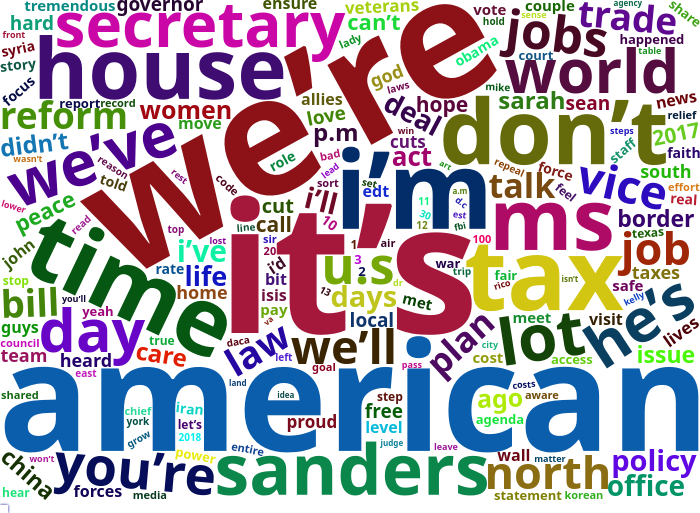

```{r setup, include=FALSE}
knitr::opts_chunk$set(echo = TRUE, message=FALSE, warning = FALSE)
```

# Presidential Press

The language of presidential communications is interesting and I know very little about *text as data*.  I have a number of applications in mind for these tools but I have to learn how to use them.  What does the website look like?

[White House News](https://www.whitehouse.gov/news/)

The site is split in four parts: all news, articles, presidential actions, and briefings and statements.  The first one is a catch all and the second is news links.  I will take the last two to process.  To create a proper workflow, I will separate the investigation into two types of communications: briefing statements and presidential actions.  For each, I will have to build a table of links and then I can extract the actual text.

## Processing the Communications: Links

First, let me take on briefing statements.  I will build a database of URLs to then process as text.  This works for the design of the White House website currently; the only relevant hard-coding is the number of browsable pages.  I captured this manually.


```{r URLTab, eval=FALSE}
library(rvest)
n.BSt <- 208
BSt.seq <- as.list(seq(1,n.BSt))
BSt.fun <- function(val) {
my.URL <- paste("https://www.whitehouse.gov/briefings-statements/page/",val,"/",sep="")
temp.l1 <- read_html(my.URL)
my.links <- html_nodes(temp.l1, 'h2') %>% html_nodes("a") %>% html_attr('href')
my.links2 <-html_nodes(temp.l1, 'h2') %>% html_text("a") 
data.frame(link=my.links,title=my.links2)
}
n.PAct <- 46
PAct.seq <- as.list(seq(1,n.PAct))
PAct.fun <- function(val) {
my.URL <- paste("https://www.whitehouse.gov/presidential-actions/page/",val,"/",sep="")
temp.l1 <- read_html(my.URL)
my.links <- html_nodes(temp.l1, 'h2') %>% html_nodes("a") %>% html_attr('href')
my.links2 <-html_nodes(temp.l1, 'h2') %>% html_nodes("a") %>% html_text("a") 
data.frame(link=my.links,title=my.links2)
}
BriefState.linkset <- do.call("rbind",rapply(BSt.seq, BSt.fun, how="list"))
PresAct.linkset <- do.call("rbind",rapply(PAct.seq,PAct.fun, how="list"))
```

I now have all the links.  I cannot do much with that.

## Text Extraction

I will first write a simple function to download a URL and extract the text that I want.

```{r TextExt1}
library(rlist)
library(stringr)
PPR.Filter <- function(file) {
temp.res <- str_replace_all(html_text(html_nodes(file, xpath='(//*[contains(concat( " ", @class, " " ), concat( " ", "editor", " " ))])//*[not(ancestor::aside or name()="aside")]/text()')), "[\t\n]" , "")
temp.res
}
web.fetch <- function(URL) {
temp.web <- read_html(URL)
}
PPR.Filter.Wrap <- function(URL) {
  temp.res <- PPR.Filter(web.fetch(URL))
  temp.res <- list.clean(temp.res, function(x) nchar(x) == 0, TRUE)
  temp.res 
}
#Res1 <- PPR.Filter.Wrap("https://www.whitehouse.gov/briefings-statements/president-donald-j-trumps-first-year-of-foreign-policy-accomplishments/")
#Res2 <- PPR.Filter.Wrap("https://www.whitehouse.gov/briefings-statements/press-briefing-press-secretary-sarah-sanders-121917/")
```


### Scraping Presidential Actions

```{r PPRFT1, eval=FALSE}
Pres.Acts <- lapply(as.character(PresAct.linkset$link), PPR.Filter.Wrap)
```

### Scraping the Briefings and Statements

```{r PPRFT2, eval=FALSE}
Statements.Briefings <- lapply(as.character(BriefState.linkset$link), PPR.Filter.Wrap)
save(Pres.Acts,PresAct.linkset,Statements.Briefings,BriefState.linkset, file="data/PresText.RData")
```

# Tidying the Text

```{r DataL}
library(here)
load(url("https://github.com/robertwwalker/academic-mymod/raw/master/data/PresText.RData"))
```


The hard work is in cleaning up the text.  When the document was compiled, there were `r  length(Statements.Briefings)` statements and briefings and there were `r length(Pres.Acts)` Presidential actions with each as a list in the bigger list.  I will unlist each individual document and transform it to character.  For housekeeping, I will also tally the docs and the line/paragraph numbers; this fails for a misalignment in one of the two examples.

```{r TTLoad, echo=TRUE, eval=TRUE}
library(dplyr)
library(magrittr)
library(tidytext)
text_df <- data_frame(text=as.character(unlist(Pres.Acts))) # Create characters
k <- NULL
for (i in 1:length(Pres.Acts)) {
  k <- c(k,length(Pres.Acts[[i]]))
}
mydoc <- data.frame(rep(c(seq(1,length(Pres.Acts))),k))
myline <- data.frame(unlist(as.vector(sapply(k, function(x) {cbind(seq(1,x))}))))
ind.df <- data.frame(doc=mydoc,line=myline)
myPA.df <- data.frame(doc=mydoc,line=myline,text=text_df) # A full dataset
names(myPA.df) <- c("doc","line","text")
tidy.PA <-myPA.df %>%
# group_by(doc) %>%
 unnest_tokens(word, text)
text_df <- data_frame(text=as.character(unlist(Statements.Briefings)))
k <- NULL
for (i in 1:length(Statements.Briefings)) {
  k <- c(k,length(Statements.Briefings[[i]]))
}
mydoc <- rep(c(seq(1,length(Statements.Briefings))),k)
# myline <- unlist(as.vector(sapply(k, function(x) {cbind(seq(1,x))})))
# ind.df <- data.frame(doc=mydoc,line=myline)
mySB.df <- data.frame(doc=mydoc,text=text_df)
names(mySB.df) <- c("doc","text")
tidy.SB <-mySB.df %>%
# group_by(doc) %>%
 unnest_tokens(word, text)
data(stop_words)
# Remove stop words
tidy.SB <- tidy.SB %>%
  anti_join(stop_words)
tidy.PA <- tidy.PA %>%
  anti_join(stop_words)
```

# what does the President talk about?

Word frequencies can be tabulated for each set of data.  I will plot the barplots.

## Statements and Briefings

```{r SBplot}
library(ggplot2)
tidy.SB %>%
  count(word, sort = TRUE) %>%
  filter(n > 5000) %>%
  mutate(word = reorder(word, n)) %>%
  ggplot(aes(word, n)) +
  geom_col() +
  xlab(NULL) +
  coord_flip()
```

## Presidential Actions

```{r PAplot}
library(ggplot2)
tidy.PA %>%
  count(word, sort = TRUE) %>%
  filter(n > 500) %>%
  mutate(word = reorder(word, n)) %>%
  ggplot(aes(word, n)) +
  geom_col() +
  xlab(NULL) +
  coord_flip()
```

## Word Clouds

### Presidential Actions

```{r WCPA}
library(wordcloud); library(tm)
set.seed(1234)
wc <- tidy.PA %>% count(word, sort = TRUE)
wordcloud(wc$word,  wc$n, min.freq = 1,
          max.words=200, random.order=FALSE, rot.per=0.35, 
          colors=brewer.pal(8, "Dark2"))
```

### Statements and Briefings

```{r WCSB, message=FALSE, warning=FALSE, results='hide'}
library(wordcloud2)
wc <- tidy.SB %>% count(word, sort = TRUE)
wc$freq <- wc$n
wc$n <- NULL
hw <- wordcloud2(wc, size=3)
library(htmlwidgets)
saveWidget(hw,"1.html",selfcontained = F)
webshot::webshot("1.html","1.png",vwidth = 700, vheight = 500, delay =10)
```

