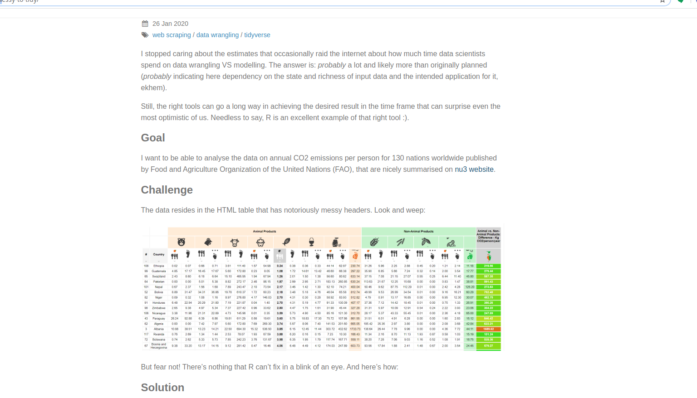

# `tidyTuesday` on the Carbon Footprint of Feeding the Planet

The tidyTuesday for this week relies on data scraped from the Food and Agricultural Organization of the United Nations.  The blog post for obtaining the data can be found on [r-tastic](https://r-tastic.co.uk/post/from-messy-to-tidy/).  The scraping exercise is nice and easy to follow and explored a case of cleaning up a very messy data structure.  I took this exercise as practice for using `pivot_wider` and `pivot_longer`.  The data are by country so a map seems appropriate.  

```{r}
library(tidyverse)
food_consumption <- readr::read_csv('https://raw.githubusercontent.com/rfordatascience/tidytuesday/master/data/2020/2020-02-18/food_consumption.csv')
names(food_consumption)
```

As you can see, the variables are already tidy.  What categories of food are available?

```{r}
table(food_consumption$food_category)
```

NB: There are five names of countries that do not reconcile with the world map that I will use.  The `United Kingdom` is `UK`.  `Taiwan. ROC` is `Taiwan`.  Trinidad and Tobago are separate on the map but together in the data.  Hong Kong is not differentiated from China on the map.  `Congo` is ambiguous because it could refer to the DRC or Rep. of Congo.  I will ignore the error on Hong Kong and skip Congo.

```{r}
food_consumption$country[food_consumption$country=="United Kingdom"] <- "UK"
TNT <- food_consumption %>% filter(country=="Trinidad and Tobago")
food_consumption$country[food_consumption$country=="Trinidad and Tobago"] <- "Trinidad"
food_consumption <- rbind(food_consumption,TNT)
food_consumption$country[food_consumption$country=="Trinidad and Tobago"] <- "Tobago"
food_consumption$country[food_consumption$country=="Taiwan. ROC"] <- "Taiwan"
```


I want to map the totals which were removed from the posted data set.  Let me recreate those.  I will first do the co2 column.  I need to drop consumption, pivot them to wide, and sum up the numeric variables.  Then I want to pivot it back to long with the total as a food category.

```{r}
FCCO2W <- food_consumption %>% 
  select(-consumption) %>% 
  pivot_wider(.,names_from = food_category, values_from = co2_emmission, names_prefix = "CO2_")  %>% 
  mutate(CO2_Total = rowSums(select(., contains("CO2_")))) 
FCCO2L <- FCCO2W %>% 
  pivot_longer(., cols = names(FCCO2W)[2:13], values_to = "CO2") %>% 
  mutate(food_category = str_remove(name, "CO2_")) %>% 
  select(-name)
```

Now there are long and wide versions of CO2.  Same process for food production.

```{r}
FCConsumeW <- food_consumption %>% 
  select(-co2_emmission) %>% 
  pivot_wider(.,names_from = food_category, values_from = consumption, names_prefix = "Consumption_") %>% 
  mutate(Consumption_Total = rowSums(select(., contains("Consumption_")))) 
FCConsumeL <- FCConsumeW %>% 
  pivot_longer(., cols = names(FCConsumeW)[2:13], values_to = "Consumption") %>% 
  mutate(food_category = str_remove(name, "Consumption_")) %>% 
  select(-name)
```

Finally, let me merge them back together.  One version of Rejoinder is long [L] and the other is wide [W].

```{r}
RejoinderL <- left_join(FCCO2L,FCConsumeL, by = c("country","food_category"))
RejoinderW <- left_join(FCCO2W,FCConsumeW, by = "country")
```

With that manipulation and cleaning complete, it is time to map it.

```{r, message=FALSE, warning=FALSE}
require(maps)
require(viridis)
theme_set(
  theme_void()
)
# A Base Map
world_map <- map_data("world")
world_map <- world_map %>% mutate(country = region) 
WM <- ggplot(world_map, aes(x = long, y = lat, group = group)) +
  geom_polygon(fill="lightgray", colour = "white")
WM
```

That's a map to work with.  Now let me join the data and plot the CO2 production.  There is a check before to make sure that all the matches are mapped.

```{r}
anti_join(RejoinderW, world_map)
```

I fixed the original entries that exist above; some failures can't be fixed.

```{r}
FCWM <- world_map %>% left_join(., RejoinderW)
WMCO2 <- ggplot(FCWM, aes(x = long, y = lat, group = group, fill=CO2_Total)) +
  geom_polygon(colour = "white") + 
  scale_fill_viridis_c(option = "C") +
  labs(fill = "Total CO2", title="Total CO2 from Food Produced for Consumption [kg/person/year]", caption="a #tidyTuesday by @PieRatio")
WMCO2
```

Now let me plot the food produced for consumption.

```{r}
WMFood <- ggplot(FCWM, aes(x = long, y = lat, group = group, fill=Consumption_Total)) +
  geom_polygon(colour = "white") + 
  scale_fill_viridis_c(option = "C") +
  labs(fill = "Total", title="Total Food Produced for Consumption [kg/person/year]", caption="a #tidyTuesday by @PieRatio")
WMFood
```

I wanted to combine them but that did not work with patchwork.

```{r, echo=TRUE, eval=FALSE}
WMCO2 + WMFood
# Doesn't work.
```

Now let me do them with facets.  That will require taking the merged wide data and pivoting it to longer.  First, I will select the columns that are critical to the map and the two series that I need.  I also want to change the names up a bit to make the facets well labeled.  After that, pivot to longer so that I can map the two categories separately.  One thing that went wrong along the way is the guide.  The facets are given a common guide while food in kg has a vastly different scale than CO2.  The easiest way to show them is to use a z-score for each and to show how the various countries compare to the average [keep in mind they are already normalized by population].

```{r}
Map.Me <- FCWM %>% select(long, lat, group, order, region, CO2_Total, Consumption_Total) %>% mutate(CO2_Total = scale(CO2_Total), `Food Supplied_Total` = scale(Consumption_Total)) %>% select(-Consumption_Total)
Map.Me <- pivot_longer(Map.Me, cols = c(CO2_Total, `Food Supplied_Total`)) %>% mutate(name = str_remove(name, "_Total"))
Facet.Map <- ggplot(Map.Me, aes(x = long, y = lat, group = group, fill=value)) +
  geom_polygon(colour = "white") + 
  scale_fill_viridis_c(option = "C") +
  labs(fill = "kg/person/year", caption="a #tidyTuesday by @PieRatio", title="Food Produced for Consumption and the CO2 Impact", subtitle = "Z-scored for comparability; greys are missing.") +
  facet_wrap(vars(name))
Facet.Map
```

Cool.  It works.  Now I want to go back to the original data and the blog post.  That is fundamentally concerned with a differential.



# Animal vs. Non-Animal CO2

These data will require some recreation; that's the reason for keeping and creating the wide data above.  The pivots.  I don't really care so much about the actual food production here; this is about the carbon footprint.  There is a color coding key to the above spreadsheet and I just need to pull it out.  The oranges are animal and the greens are not.  Just pick out the right columns to sum up and we are ready to go.  Above, that is the FCC02W data.frame.  As an aside, this is yet another criticism of spreadsheets; you can encode data in the colors that isn't recoverable in any interesting way.

First, the reason they are missing is that that part of the scraping is a bit kludgy; the original author was seeking comment on it.  Perhaps you can skip columns that are sums of those that precede it.  The tidyTuesday has the cleaning script.  I just have to remove the filter.

```{r}
library(tidyverse)
library(janitor)
library(rvest)

# Credit to Kasia and minorly edited to create output file and test plot
# Blog post at https://r-tastic.co.uk/post/from-messy-to-tidy/

url <- "https://www.nu3.de/blogs/nutrition/food-carbon-footprint-index-2018"

# scrape the website
url_html <- read_html(url)

# extract the HTML table
whole_table <- url_html %>% 
  html_nodes('table') %>%
  html_table(fill = TRUE) %>%
  .[[1]]

table_content <- whole_table %>%
  select(-X1) %>% # remove redundant column
  filter(!dplyr::row_number() %in% 1:3) # remove redundant rows

raw_headers <- url_html %>%
  html_nodes(".thead-icon") %>%
  html_attr('title')

tidy_bottom_header <- raw_headers[28:length(raw_headers)]
tidy_bottom_header[1:10]

raw_middle_header <- raw_headers[17:27]
raw_middle_header

tidy_headers <- c(
  rep(raw_middle_header[1:7], each = 2),
  "animal_total",
  rep(raw_middle_header[8:length(raw_middle_header)], each = 2),
  "non_animal_total",
  "country_total")

tidy_headers

combined_colnames <- paste(tidy_headers, tidy_bottom_header, sep = ';')
colnames(table_content) <- c("Country", combined_colnames)
glimpse(table_content[, 1:10])

long_table <- table_content %>%
  # make column names observations of Category variable
  tidyr::pivot_longer(cols = -Country, names_to = "Category", values_to = "Values") %>%
  # separate food-related information from the metric
  tidyr::separate(col = Category, into = c("Food Category", "Metric"), sep = ';')

glimpse(long_table)

tidy_table <- long_table %>%
  tidyr::pivot_wider(names_from = Metric, values_from = Values) %>%
  janitor::clean_names('snake')

glimpse(tidy_table)

final_table <- tidy_table %>%
  rename(consumption = 3,
         co2_emission = 4)

clean_table <- final_table %>% 
    mutate_at(vars(consumption, co2_emission), parse_number)
```

## An Alternative

Quick and dirty base R.

```{r}
names(FCCO2W)
FCCO2W$Animal.CO2 <- rowSums(FCCO2W[,c(2:8)])
FCCO2W$Non.Animal.CO2 <- rowSums(FCCO2W[,c(9:12)])
FCC02W <- FCCO2W %>% mutate(CO2.Footprint.Difference = Animal.CO2 - Non.Animal.CO2)
```

And plot it.

```{r}
FCWM <- world_map %>% left_join(., FCC02W)
WMCO2 <- ggplot(FCWM, aes(x = long, y = lat, group = group, fill=CO2_Total)) +
  geom_polygon(colour = "white") + 
  scale_fill_viridis_c(option = "B") +
  labs(fill = "CO2 kg/person/yr", title="CO2 Difference (Animal - Non-Animal)", subtitle ="from Food Produced for Consumption", caption="a #tidyTuesday by @PieRatio")
WMCO2
```

