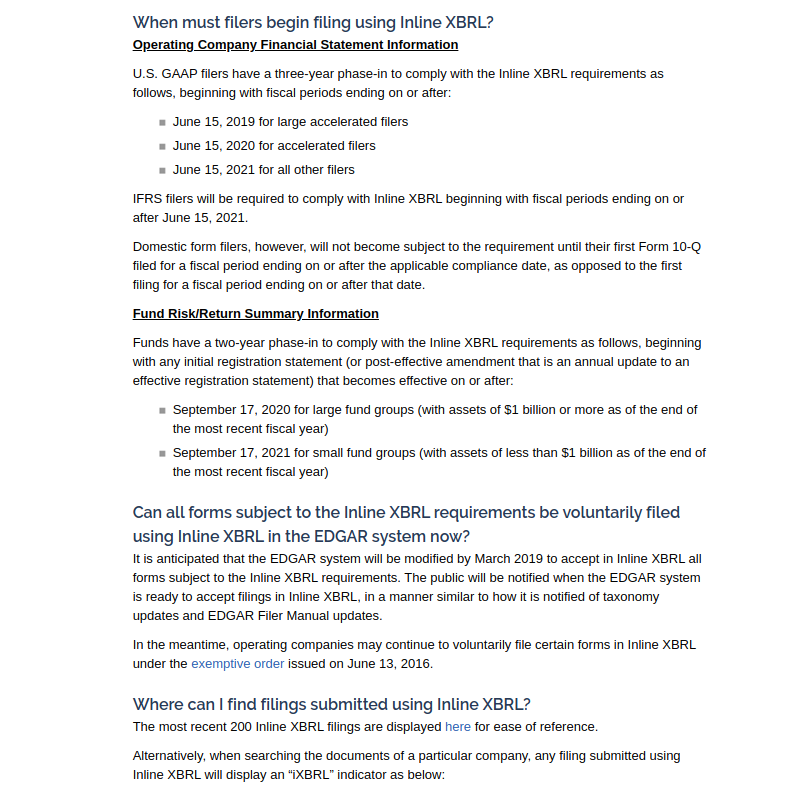

# XBRL Changed

XBRL has undergone and is undergoing some changes.  Some filers have already needed to change their filings and others will have to soon.  Here is the excerpt.



This has broken many of the existing parsers for new filings.  It is time to find a way around this.  I have seen links for scraping them from [Yahoo! Finance](https://towardsdatascience.com/web-scraping-for-accounting-analysis-using-python-part-1-b5fc016a1c9a) but that is not really what I want.


```{r}

```

