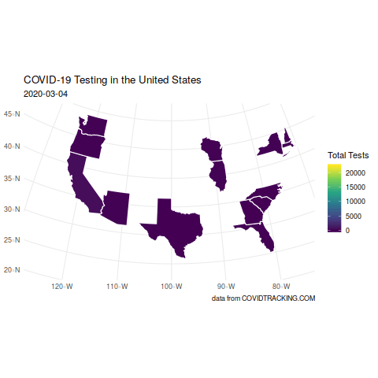

```{r setup, include=FALSE}
knitr::opts_chunk$set(echo = TRUE, message = FALSE, warning = FALSE)
```

# R to Import COVID Data

```{r}
library(tidyverse)
library(gganimate)
COVID.states <- read.csv(url("http://covidtracking.com/api/states/daily.csv"))
COVID.states <- COVID.states %>% mutate(Date = as.Date(as.character(date), format = "%Y%m%d"))
```

## The Raw Testing Incidence

I want to use patchwork to show the testing rate by state in the United States.  Then I want to show where things currently stand.  In both cases, a base-10 log is used on the number of tests.

```{r}
library(patchwork)
p1 <- ggplot(COVID.states) +
 aes(x = Date, y = total, colour = state) +
 geom_line(alpha=0.4) +
 scale_color_hue() + labs(y="Total Tested", colour="", title="COVID Testing by State", caption="data from COVIDTRACKING.COM")+ theme_minimal() + scale_y_log10() + theme(legend.text=element_text(size=rel(0.75)))
p2 <- COVID.states %>% filter(Date=="2020-03-19") %>% ggplot(., aes(x=reorder(state, total), y=total, fill=state)) + geom_col() + guides(fill=FALSE) + coord_flip() + labs(y="Total Tested log(base 10)", x="", caption="data from COVIDTRACKING.COM") + scale_y_log10() + theme(axis.text=element_text(size=rel(0.5)))
p1 + p2
```

## A Map

Now let me map, for the United States, the total number of tests as of today.

```{r}
library(ggthemes)
library(urbnmapr)
State.Map <- get_urbn_map("states", sf=TRUE)
Today <- COVID.states %>% filter(Date=="2020-03-19")
Plot.Me <- left_join(State.Map, Today, by = c("state_abbv" = "state"))
ggplot(Plot.Me) +
    aes(fill = total) +
    geom_sf(size = 0.5, color="white") +
    scale_fill_viridis_c() +
    theme_minimal() + labs(title="COVID-19 Testing in the United States", subtitle="2020-03-19", caption="data from COVIDTRACKING.COM", fill="Total Tests")
```

## Animate the Map

I will animate it with gganimate.

```{r, cache=TRUE, eval=FALSE}
library(gifski)
library(gganimate)
Plot.Me <- left_join(State.Map, COVID.states, by = c("state_abbv" = "state"))
anim1 <- ggplot(Plot.Me, aes(fill = total, geometry=geometry)) +
    geom_sf(size = 0.5, color="white") +
    scale_fill_viridis_c() +
    theme_minimal() + labs(title="COVID-19 Testing in the United States", subtitle="{frame_time}", caption="data from COVIDTRACKING.COM", fill="Total Tests") + transition_time(Date)
MyAnim <- animate(anim1, renderer=gifski_renderer(), end_pause = 40)
save_animation(MyAnim, file="/home/rob/Sandbox/awful/content/post/2020-03-19-tracking-covid-19/animate/covidmap.gif")
```


## A bit more detail

Total tests in black; positives in red and negatives in green.

```{r}
ggplot(COVID.states) +
 aes(x = Date) +
 geom_line(aes(y=total), color="black") +
 geom_line(aes(y=positive), color="red") +
 geom_line(aes(y=negative), color="green") +
 theme_minimal() +
 facet_wrap(vars(state), scales = "free_y")
```

## A Plotly

Put the map into plotly with a tool tip that lists the various testing data.

```{r}
Today <- Today %>% mutate(ttip = paste("Pos:", positive,"<br> Neg:", negative,"Total:", total))
Plot.Me <- left_join(State.Map, Today, by = c("state_abbv" = "state"))
pm <- ggplot(Plot.Me, aes(fill = total, text=ttip)) +
    geom_sf(size = 0.5, color="white") +
    scale_fill_viridis_c() +
    theme_minimal() + labs(title="COVID-19 Testing in the United States", subtitle="2020-03-19", caption="data from COVIDTRACKING.COM", fill="Total Tests")
library(plotly)
fw2 <- ggplotly(pm, tooltip="text")
widgetframe::frameWidget(fw2)
```

# World Data

The [ECDC: European Center for Disease Prevention and Control](https://www.ecdc.europa.eu/en/publications-data/download-todays-data-geographic-distribution-covid-19-cases-worldwide) provides official global tracking data for COVID-19.  Their site even includes `R` code for downloading and importing the data.

```{r}
library(readxl); library(httr)
url <- paste("https://www.ecdc.europa.eu/sites/default/files/documents/COVID-19-geographic-disbtribution-worldwide-",format(Sys.time(), "%Y-%m-%d"), ".xlsx", sep = "")
#download the dataset from the website to a local temporary file
GET(url, authenticate(":", ":", type="ntlm"), write_disk(tf <- tempfile(fileext = ".xlsx")))
#read the Dataset sheet into “R”
COVID.world <- read_excel(tf)
str(COVID.world)
```

# Mapping Cases

Start with a map from `rnaturalearth`.  I plot the map here.

```{r}
library(ggthemes)
library(rnaturalearth)
library(rnaturalearthdata)
world <- ne_countries(scale = "medium", returnclass = "sf")
ggplot(world) + geom_sf() + theme_map()
```

Next, join the data to the map.  

```{r}
Totals <- COVID.world %>% group_by(GeoId) %>% summarise(Deaths.Total = sum(Deaths), name=first(`Countries and territories`))
Map.Me <- left_join(world, Totals, by=c("iso_a2" = "GeoId"))
```


This obscures important spatial data about location by aggregating cases by countries.  That said, it gives a view of what is going on.

```{r}
My.Map <- ggplot(Map.Me, aes(fill=Deaths.Total, geometry=geometry, text=name.y)) + geom_sf(size=0.1, color="white") + theme_map()
plotly::ggplotly(My.Map)
```

