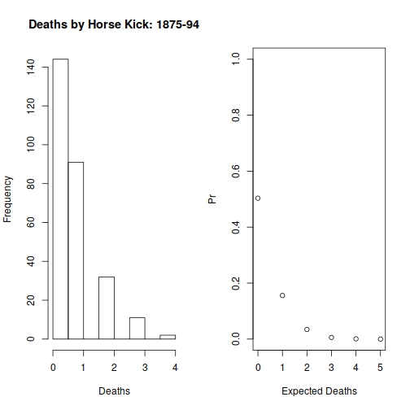

Probability Distributions
========================================================
author: Robert W. Walker
date: Wed Feb 12 13:02:05 2020
autosize: true

Probability: The Logic of Science
========================================================

Jaynes presents a few core ideas and requirements for his rational system.  Probability emerges as the representation of circumstances in which any given realization of a process is either TRUE or FALSE but both are possible and expressable by probabilities

- that sum to one for all events
- are greater than or equal to zero for any given event


General Representation of Probability
========================================================

Is of necessity two-dimensional,

- We have $x$ and 
- we have $Pr(X=x)$ in one of two forms (Pr or f).

***


Probability Distributions of Two Forms
========================================================

Our core concept is a probability distribution just as above.  These come in two forms for two types [discrete (qualitative)] and continuous (quantitative)]:

***
- Assumed
- Derived


The Poster and Examples
========================================================

Distributions are nouns.  Sentences are incomplete without verbs -- parameters.  We need both; it is for this reason that the former slide is true.  We do not always have a grounding for either the name or the parameter.

Continuous vs. Discrete Distributions
========================================================

The differences are sums versus integrals.  Why?
- Histograms or
- Density Plots

The probability of exactly any given value is zero on a true continuum.

***
Expectation

$$E(X) = \sum_{x \in X} x \cdot Pr(X=x)$$
$$E(X) = \int_{x \in X} x \cdot f(x)dx$$

Variance

$$E[(X-\mu)^2] = \sum_{x \in X} (x-\mu)^2 \cdot Pr(X=x)$$
$$E((X-\mu)^2) = \int_{x \in X} (x-\mu)^2 \cdot f(x)dx$$


Distributions in R
========================================================
Are defined by four core parts: 

- r, for random variables
- p, for cumulative probability [counting from left]
- d, for density/probability that $X=x$
- q, for quantile

Distributions We Deploy
========================================================

- Normal [and functions of it] [C]
- Bernoulli and Binomial [D]
- Geometric [D]
- Poisson/Negative Binomial [D]
- Uniform [C]

The Normal Distribution [Gaussian]
========================================================

$$f(x|\mu,\sigma^2 ) = \frac{1}{\sqrt{2\pi\sigma^{2}}} \exp \left[ -\frac{1}{2} \left(\frac{x - \mu}{\sigma}\right)^{2}\right]  
$$
Is the workhorse of statistics.  Key features:
- Is self-replicating: sums of normals are normal.
- If $X$ is normal, then $$ Z = \frac{(X - \mu)}{\sigma} $$ is normal.
- Aside, $$ z_{x} = \frac{(x - \overline{x})}{s_{x}} $$ has mean 0 and variance/std. dev. 1.


The Canonical Normal: Z
===============================================


Why Normals?
========================================================

- The Central Limit Theorem
- They Dominate Ops [$6\sigma$]
- Normal Approximations Abound

An Example: Tire Lifetimes
=========================================================

A brand of steel belted radial tire has a lifetime expressed in miles that is normal with mean 96000 and standard deviation 12000.  Two questions:

1. If a warranty is set for 60,000 miles, what proportion of tires should require warranty service?

2. What mileage requires only a 1% replacement rate?
***


Tire Lifetimes
=========================================================

A brand of steel belted radial tire has a lifetime expressed in miles that is normal with mean 96000 and standard deviation 12000.  Two questions: *Normal(96000,12000)*

1. If a warranty is set for 60,000 miles, what proportion of tires should require warranty service?

```r
pnorm(60000,96000,12000)
```

```
[1] 0.001349898
```
***


An Example: Tires and Warranties
=========================================================

A brand of steel belted radial tire has a lifetime expressed in miles that is normal with mean 96000 and standard deviation 12000.  Two questions: *Normal(96000,12000)*

2. What mileage requires only a 1% replacement rate?

```r
qnorm(0.01,96000,12000)
```

```
[1] 68083.83
```
***


Bernoulli Trials and the Binomial
=====================================================
Suppose the variable of interest is discrete and takes only two values: yes and no.  For example, is a customer satisfied with the outcomes of a given service visit?  

For each individual, because the probability of yes ($\pi$) and no must sum to one, we can write:

$$f(x|\pi) = \pi^{x}(1-\pi)^{1-x}$$
***
For multiple identical trials, we have the Binomial:

$$f(x=k|n,\pi) = {n \choose k} \pi^{k}(1-\pi)^{n-k}$$
where $${n \choose k} = \frac{n!}{(n-k)!}$$

The Binomial
=====================================================


***

$$ p(X = k|Binomial(n,\pi)) = $$
$$ { n \choose k } \pi^{k}(1-\pi)^{n-k} $$ for k = 0, 1, 2, $\ldots$, n, where

$$ {{n} \choose {k}}={\frac {n!}{k!(n-k)!}} $$

$R$ can calculate it with `choose(n,k)`.

Example: 0.5?
======================================================
Post service, 100 customers were surveyed and asked one question: Satisfied?  *47 said yes*  Does this mean we are awful? 

Example: 0.5?
======================================================
Post service, 100 customers were surveyed and asked one question: Satisfied?  *47 said yes*  Does this mean we are awful? *Binomial(0.5,n=100)*
***


Example: 0.5?
======================================================
Post service, 100 customers were surveyed and asked one question: Satisfied?  *47 said yes*  

Does this mean we are awful? *Binomial(0.5,n=100)*  

No.  If customers were indifferent [p=0.5], we should see only 47 satisfied about 30% of the time.


```r
pbinom(47,100,0.5)
```

```
[1] 0.3086497
```


***


Geometric Distributions
====================================================
How many failures before the first success?  Now defined exclusively by $p$.  In each case, (1-p) happens $k$ times.  Then, on the $k+1^{th}$ try, p.  Note 0 failures can happen...

$$Pr(y=k) = (1-p)^{k}p$$

Example: Entrepreneurs
========================================================
Suppose any startup has a $p=0.1$ chance of success.  How many failures?
***


Example: Entrepreneurs
========================================================
Suppose any startup has a $p=0.1$ chance of success.  How many failures for the average/median person?

```r
qgeom(0.5,0.1)
```

```
[1] 6
```

***


Events: The Poisson
================================================================


***

Take a binomial with $p$ very small and let $n \rightarrow \infty$.  We get the Poisson distribution ($y$) given an arrival rate $\lambda$ specified in events per period.

$$f(y|\lambda) = \frac{\lambda^{y}e^{-\lambda}}{y!}$$


Examples: The Poisson
================================================================
- Walk in customers
- *Emergency Room Arrivals*
- Births, deaths, marriages
- *Prussian Cavalry Deaths by Horse Kick*
- Fish?

Emergency Room Arrivals
=============================================
Suppose trauma victims arrive at a rate of 12 per hour.  You schedule ER teams that can see 2 patients per hour and you want enough teams so that 95% of hours are properly staffed.
***


Emergency Room Arrivals
=============================================
Suppose trauma victims arrive at a rate of 12 per hour.  You schedule ER teams that can see 3 patients per hour and you want enough teams so that 95% of hours are properly staffed.


```r
qpois(0.95, 12)
```

```
[1] 18
```

***


Deaths by Horse Kick
=======================================================

```r
library(vcd)
data(VonBort)
head(VonBort)
```

```
  deaths year corps fisher
1      0 1875     G     no
2      0 1875     I     no
3      0 1875    II    yes
4      0 1875   III    yes
5      0 1875    IV    yes
6      0 1875     V    yes
```

```r
mean(VonBort$deaths)
```

```
[1] 0.7
```
***

The Exponential Distribution
======================================================

Describes the time between Poisson arrivals with rate $\lambda$.  Of course, if the expected number of arrivals is large, this is certain to be less than one as a fraction of whatever units the *rate* is defined over.  For example, how long should a Prussian cavalry unit expect to wait between deaths by horsekick?

=================================================


```r
plot(density(rexp(10000, 0.7)), main="Interval Between DbHKs", xlab="Years")
```


The Uniform Distribution
=======================================================
- Is flat, each value is equally likely.
- Defined on 0 to 1 gives a random cumulative probability $X \leq x$.

***


Monte Carlo Simulation
========================================================
Putting it together.

1.	Customers arriving at a car dealership at a rate of 6 per hour.
2.	Each customer has a 15% probability of making a purchase.
3.	Purchases have 
 a.	uniform profits over the interval $1000-$3000.
 b.	Normal profits that average 1500 with standard deviation 500

Let's produce and graph the solution.

Monte Carlo Simulation
========================================================
Putting it together. *r*, let's try 1000.

1.	Customers arriving at a car dealership at a rate of 6 per hour.
2.	Each customer has a 15% probability of making a purchase.
3.	Purchases have 
  +	Uniform profits over the interval $1000-$3000.
  +	Normal profits that average $1500 with standard deviation $500
*
Let's produce and graph the solution.
***

```r
library(tidyverse)
Customers <- rpois(1000, 6) # Customers ~ Poisson(6)
Purchasers <- rbinom(1000, size=Customers, prob=0.15) # P ~ Binomial(Customers,0.15)
# Next part needs a coding trick.  For each row [of 1000], I want sum the Profits given Purchasers random draws.
Profits.U <- 1:1000 %>% map_dbl(~ sum(runif(Purchasers[[.]], 1000, 3000)))
Profits.N <- 1:1000 %>% map_dbl(~ sum(rnorm(Purchasers[[.]], 1500, 500)))
```

Solutions
======================================================


```r
par(mfrow=c(1,1))
plot(x=Customers, y=Purchasers)
```


***

