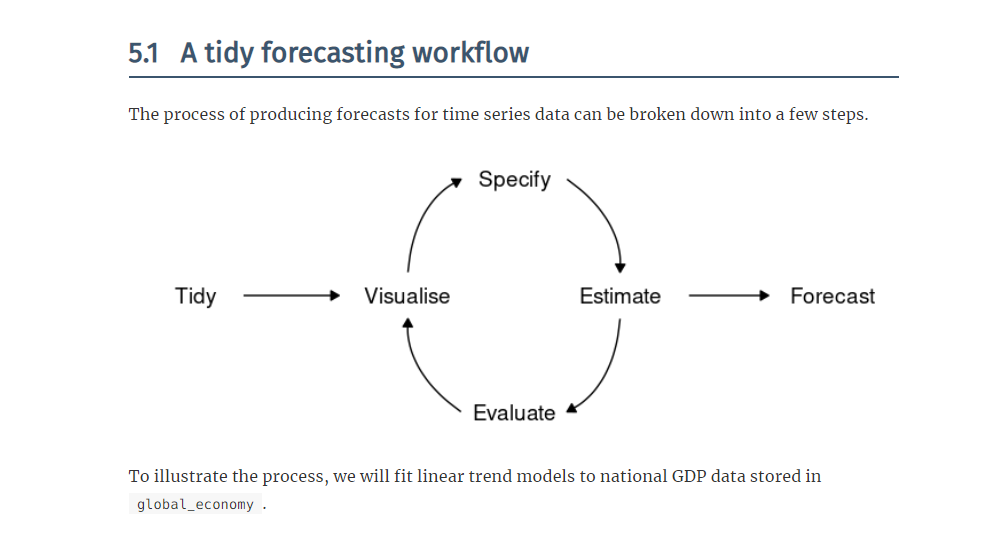

```{r setup, include=FALSE}
options(htmltools.dir.version = FALSE)
knitr::opts_chunk$set(fig.retina=3, fig.width=8, fig.height=5, warning=FALSE, message=FALSE, comment='')
library(tidyverse)
library(fpp3)
library(purrr)
library(gganimate)
library(tsibble)
options(scipen=4)
library(tidyquant)
```

```{r xaringan-themer, include=FALSE, warning=FALSE}
library(xaringan)
library(xaringanthemer)
style_mono_accent(base_color = "#43418A", text_font_google   = google_font("Fira Sans", "300", "300i"))
```

# An Overview

Expanding the space of relevant models still operates in the circle of chapter 5.



---
### An Overview

Expanding the space of relevant models still operates in the circle of chapter 5.

+ Linear Models: tidying up  
+ Univariate 1: **Exponential Smoothing**
+ Univariate 2: ARIMA models
+ Dynamic Regression [Tying it Together]


---
### A Bit More on Linear Models

Nonlinearity; they argue against nonlinear trends.  So now what?  Knots.  Trends are not always *monotonic*.  Witness the example of population in Afghanistan.  **NB: But this probably gets unrealistic pretty fast.**

```{r, eval=FALSE}
global_economy %>%
  filter(Country == "Afghanistan") %>%
  autoplot(Population / 1e6) +
  labs(y = "Population (millions)") +
  geom_ribbon(aes(xmin = 1979.98, xmax = 1989.13), fill = "pink", alpha = 0.4) +
  annotate("text", x = 1984.5, y = 10, label = "Soviet-Afghan war", col = "red", size = 3)
```

---

```{r, echo=FALSE}
global_economy %>%
  filter(Country == "Afghanistan") %>%
  autoplot(Population / 1e6) +
  labs(y = "Population (millions)") +
  geom_ribbon(aes(xmin = 1979.98, xmax = 1989.13), fill = "pink", alpha = 0.4) +
  annotate("text", x = 1984.5, y = 10, label = "Soviet-Afghan war", col = "red", size = 3)
```


---
# Compare

```{r, eval=FALSE}
fit <- global_economy %>%
  filter(Country == "Afghanistan") %>%
  model(
    linear = TSLM(Population ~ trend()),
    piecewise = TSLM(Population ~ trend(knots = c(1980, 1989)))
  )
fit %>% report()
```

---
# Compare

```{r, echo=FALSE}
fit <- global_economy %>%
  filter(Country == "Afghanistan") %>%
  model(
    linear = TSLM(Population ~ trend()),
    piecewise = TSLM(Population ~ trend(knots = c(1980, 1989)))
  )
fit %>% report()
```

---
## Handling Multiple Models

`mable` stores models.  The rows are given by the `key` and the columns are given by the model names.  For diagnostics on a particular model/subset, we will need a filter/select combination.

```
global_economy %>%
  model(
    linear = TSLM(Population ~ trend()),
    piecewise = TSLM(Population ~ trend(knots = c(1980, 1989)))
  ) %>%
  filter(Country=="Afghanistan") %>%
  select(piecewise) %>%
  gg_tsresiduals()
```


---
# Residual Assessment

```{r, eval=FALSE}
fit1 <- global_economy %>%
  filter(Country == "Afghanistan") %>%
  model(linear = TSLM(Population ~ trend()))
gg_tsresiduals(fit1)
```


---
# Residual Assessment

```{r, echo=FALSE}
fit1 <- global_economy %>%
  filter(Country == "Afghanistan") %>%
  model(linear = TSLM(Population ~ trend()))
gg_tsresiduals(fit1)
```

---
# Residual Assessment

```{r, eval=FALSE}
fit2 <- global_economy %>%
  filter(Country == "Afghanistan") %>%
  model(piecewise = TSLM(Population ~ trend(knots = c(1980, 1989))))
gg_tsresiduals(fit2)
```


---
# Residual Assessment

```{r, echo=FALSE}
fit2 <- global_economy %>%
  filter(Country == "Afghanistan") %>%
  model(piecewise = TSLM(Population ~ trend(knots = c(1980, 1989))))
gg_tsresiduals(fit2)
```


---
# Fit Assessment

```{r, echo=FALSE}
augment(fit) %>%
  autoplot(.fitted) +
  geom_line(aes(y = Population), colour = "black")
```


---
# Forecasts?

```{r}
fc <- fit %>% forecast(h = "5 years")
autoplot(fc) +
  autolayer(filter(global_economy %>% filter(Country == "Afghanistan")), Population)
```


---

## Packages

Getting started

```
library(tidyverse)
library(fpp3)
library(purrr)
library(gganimate)
library(seasonal)
library(tidyquant)
library(magrittr)
```
---

# The magic of `forecast`

The method:
1. Tidy  
2. Visualise  
3. Model  
  a. Specify  
  b. Estimate  
  c. Evaluate  
  d. Visualize  
4. Forecast

---

# Models

```
3. Model  
  a. Specify  
  b. Estimate  
  c. Evaluate  
  d. Visualize  
```

---
# Last Time: The Linear Model

$$y_{t} = \beta_{0} + \beta_{1}x_{t} + \epsilon_{t}$$

---
### Strengths and Limitations

Strengths:
+ Trends can be linear or nonlinear [knots].  
+ Seasonality can be naturally accommodated.  
+ Can accommodate covariates and lag structures.

Weaknesses:
+ Persistence of unknown origin and the need for decay.  This will be inherently nonlinear.

---
## Simple Exponential Smoothing

Appropriate for absence of seasons and trends.  We could use **naive** (most recent observation receives all the weight, $\alpha=1$) and **average** (all values equally weighted, $\alpha=0$) methods for such data.  Simple exponential smoothing occupies the space between with parameter $\alpha$ such that

$$\hat{y}_{T+1|T} = \alpha y_{T} + \alpha(1 - \alpha)y_{T-1} + \alpha(1-\alpha)^{2}y_{T-2} + \ldots + \alpha(1-\alpha)^{k}y_{T-k}$$

---
## Weighted Averages and the Component Form

Describe the outcome as two separate but combineable forms: a Forecast equation $$\hat{y}_{t+h|t} = S_{t}$$ and a Smoothing Equation $$S_{t} = \alpha y_{t} + (1-\alpha) S_{t-1}$$.

If we combine them, we get:

$$\hat{y}_{t+h|t} = \alpha y_{t} + (1-\alpha) S_{t-1}$$

---

## The Model: `ETS`

the `error` component (either `M` multiplicative or `A` additive)

the `trend`

the `season`

Some comments on options -- the optimization method.

---

# Holt's Trends

Describe the outcome as three separate but combinable forms: 
a Forecast equation $$\hat{y}_{t+h|t} = S_{t} + hb_{t}$$ 

a Level Equation $$S_{t} = \alpha y_{t} + (1-\alpha)(S_{t-1} + b_{t-1})$$ and 
a trend equation $$b_{t} = \beta^{*}(S_{t} - S_{t-1}) + (1-\beta^{*})b_{t-1}$$.

If we combine them, we get:

$$\hat{y}_{t+h|t} = \alpha y_{t} + (1-\alpha)(S_{t-1} + b_{t-1}) + h(\beta^{*}(S_{t} - S_{t-1}) + (1-\beta^{*})b_{t-1})$$

---
## Damping

Flatten the trend into the future.  Expand Holt's trend model with an additional damping parameter -- $\phi$.  

$$\hat{y}_{t+h|t} = S_{t} + (\phi + \phi^2 + \ldots + \phi^{h})b_{t}$$ 

$$S_{t} = \alpha y_{t} + (1-\alpha)(S_{t-1} + \phi b_{t-1})$$

$$b_{t} = \beta^{*}(S_{t} - S_{t-1}) + (1-\beta^{*})\phi b_{t-1}$$

---
## The Holt-Winters Method(s)

Describe the outcome as three separate but [additively] combinable forms: 
a Forecast equation $$\hat{y}_{t+h|t} = S_{t} + hb_{t} + s_{t + h - m(k+1)}$$ 

a Level Equation $$S_{t} = \alpha(y_{t} - s_{t-m} + (1-\alpha)(S_{t-1} + b_{t-1})$$
a trend equation $$b_{t} = \beta^{*}(S_{t} - S_{t-1}) + (1-\beta^{*})b_{t-1}$$
and a seasonal equation $$s_{t} = \gamma(y_{t} - S_{t-1} - b_{t-1}) + (1-\gamma)s_{t-m}$$.

---
# Multiplicative?


---
## Damping

[Add the damping terms in the trend to the previous:](https://otexts.com/fpp3/holt-winters.html)


---
## A Taxonomy [and the code]

A [glorious taxonomy](https://otexts.com/fpp3/taxonomy.html) for the models that all fits in one simple code expression.

```
model(ETS(outcome ~ error("A"/"M") 
+ trend(method=c("N","A","Ad")) 
+ season(method = c("N", "A", "M"))))
```

---
## Model Selection and IC [and Caveats]

NB: Multiplicative errors and negative values  [also, next slide]

Information criterion [IC] provide a measure of goodness of fit for models that may differ in number of parameters or underlying form.  Minimize it.  

`ETS` will do this automagically if not given guidance.

```{r, eval=FALSE}
aus_busines <- tourism %>%
    filter(Purpose == "Business") %>%
    summarise(Trips = sum(Trips)/1e3)
fit <- aus_busines %>%
    model(ETS(Trips))
report(fit)
```

---
# Result

```{r, echo=FALSE}
aus_busines <- tourism %>%
    filter(Purpose == "Business") %>%
    summarise(Trips = sum(Trips)/1e3)
fit <- aus_busines %>%
    model(ETS(Trips))
report(fit)
```


---
# What does it look like?

```{r}
components(fit) %>%
  autoplot() +
  labs(title = "ETS(M,N,A) components")
```

---
## Innovations and Residuals [Multiplicative]

```{r}
fit %>% augment() %>% select(.innov,.resid) %>% pivot_longer(c(.innov,.resid)) %>% autoplot()
```


---
## Forecast Variances

Not all are known analytically, but we can always use distributions of step ahead paths to simulate and summarise them.


---
# A Simplified Example

```{r}
load(url("https://github.com/robertwwalker/rww-science/raw/master/static/xaringan/CH7HA/USEmployment.RData"))
us_employment %>% data.frame() %>% group_by(Series_ID) %>% summarise(Title = first(Title)) %>% mutate(series_id = Series_ID) %>% ungroup() %>% select(-Series_ID) -> Names.List
US.Employment.T <- left_join(US.Employment, Names.List, by = c("series_id" = "series_id")) %>% mutate(YM = yearmonth(date)) %>% rename(Employed = value) %>% as_tsibble(., index=YM, key=Title)
USET <- US.Employment.T %>% filter(YM > yearmonth("1990-01"), Title%in%c("Retail Trade")) %>% as_tsibble(., index=YM, key=Title)
USEM <- US.Employment.T %>% filter(YM > yearmonth("1990-01"), Title%in%c("Manufacturing")) %>% as_tsibble(., index=YM, key=Title)
```

---
# A Model

```{r}
USETS <- USET %>% model(ETS(Employed))
USETS %>% report()
```

---
# `augment`

```{r}
augment(USETS) %>% select(.innov,.resid) %>% pivot_longer(c(.innov,.resid)) %>% autoplot()
```

---
## The residual

```{r}
USETS %>% gg_tsresiduals()
```

---
## They don't always end up MNA

```{r}
USETSM <- USEM %>% model(ETS(Employed))
USETSM %>% report()
```

---

```{r}
USETSM %>% augment() %>% select(Employed,.fitted) %>% pivot_longer(c(Employed,.fitted)) %>% autoplot()
```


---
# Diagnostics for residuals

Seek to falsify two desirable characteristics:

1. Residuals should be uncorrelated [remaining time series information] 
2. Residuals should have mean zero [otherwise bias -- systematically wrong].

Additional desiderata include: Constant variance and normalcy though the latter implies the former.

---

## Correlation and Causation

ARE NOT THE SAME.

---
# The essential workflow

[It all goes back to chapter 5](https://otexts.com/fpp3/a-tidy-forecasting-workflow.html).
