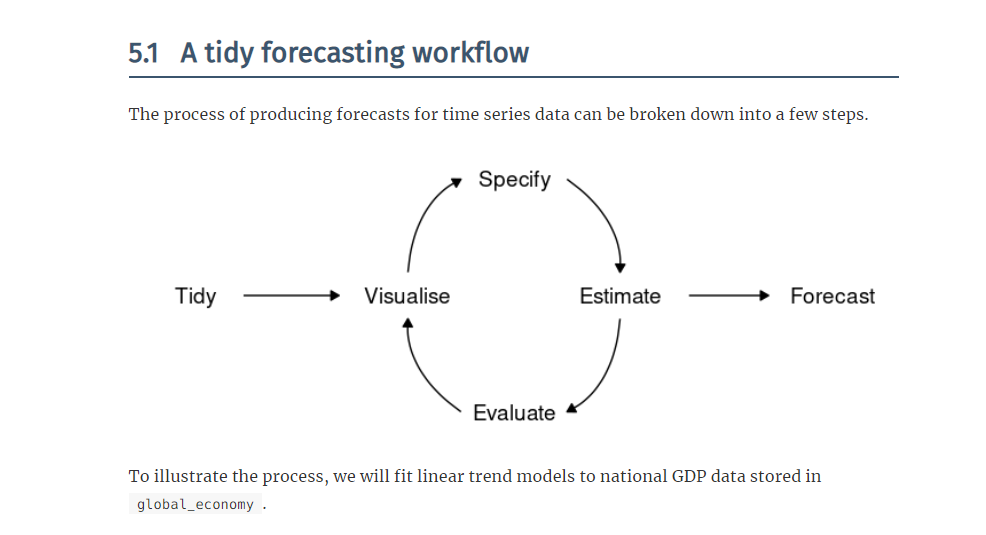
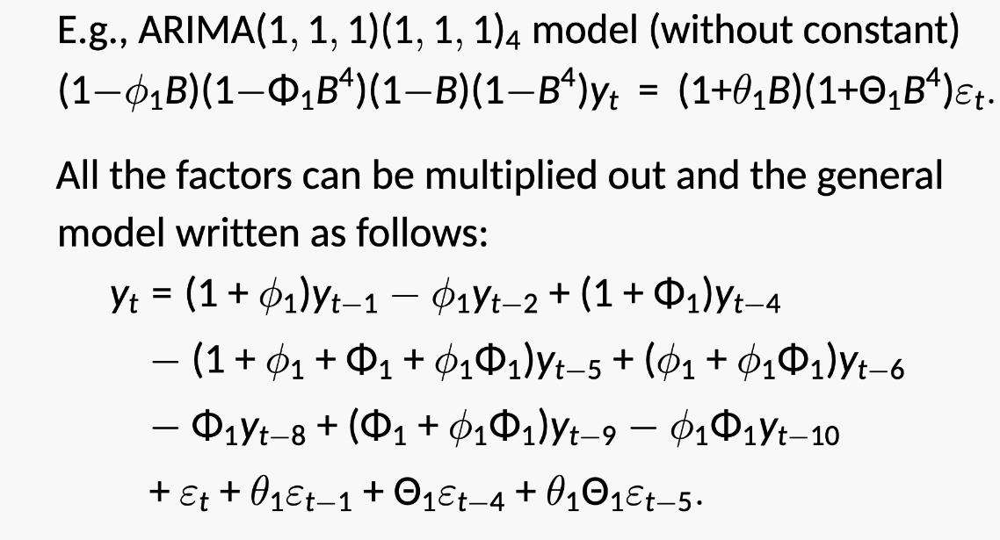

```{r setup, include=FALSE}
options(htmltools.dir.version = FALSE)
knitr::opts_chunk$set(fig.retina=3, fig.width=8, fig.height=5, warning=FALSE, message=FALSE, comment='')
library(tidyverse)
library(fpp3)
library(purrr)
library(gganimate)
library(tsibble)
options(scipen=4)
library(tidyquant)
```

```{r xaringan-themer, include=FALSE, warning=FALSE}
library(xaringan)
library(xaringanthemer)
style_mono_accent(base_color = "#43418A", text_font_google   = google_font("Fira Sans", "300", "300i"))
```

# An Overview

Expanding the space of relevant models still operates in the circle of chapter 5.



---
### An Overview

Expanding the space of relevant models still operates in the circle of chapter 5.

+ Linear Models: tidying up  
+ Univariate 1: Exponential Smoothing
+ Univariate 2: **ARIMA models**
+ Dynamic Regression [Tying it Together]


---

## Packages

Getting started

```
library(tidyverse)
library(fpp3)
library(purrr)
library(gganimate)
library(seasonal)
library(tidyquant)
library(magrittr)
```
---

# The magic of `forecast`

The method:
1. Tidy  
2. Visualise  
3. Model  
  a. Specify  
  b. Estimate  
  c. Evaluate  
  d. Visualize  
4. Forecast

---

# Models

```
3. Model  
  a. Specify  
  b. Estimate  
  c. Evaluate  
  d. Visualize  
```

---
# First: The Linear Model

$$y_{t} = \beta_{0} + \beta_{1}x_{t} + \epsilon_{t}$$

---
### Strengths and Limitations

Strengths:
+ Trends can be linear or nonlinear [knots].  
+ Seasonality can be naturally accommodated.  
+ Can accommodate covariates and lag structures.

Weaknesses:
+ Persistence of unknown origin and the need for decay.  This will be inherently nonlinear.

---
## Second: Exponential Smoothing

Describe the outcome as two separate but combineable forms: a Forecast equation $$\hat{y}_{t+h|t} = S_{t}$$ and a Smoothing Equation $$S_{t} = \alpha y_{t} + (1-\alpha) S_{t-1}$$.

If we combine them, we get:

$$\hat{y}_{t+h|t} = \alpha y_{t} + (1-\alpha) S_{t-1}$$

---

## The Model: `ETS`

the `error` component (either `M` multiplicative or `A` additive)

the `trend`

the `season`

Some comments on options -- the optimization method.

---
# ARIMA

AR: autoregressive (lagged observations as inputs)  
I: integrated  
MA: moving average (lagged errors as inputs)  

Use Case:
An ARIMA model is rarely interpretable in terms of visible data structures like trend and seasonality. But it can capture a huge range of time series patterns.

---

```{r}
library(fpp3)
library(patchwork)
library(purrr)
library(hrbrthemes)
usmelec <- as_tsibble(fpp2::usmelec) %>%
  rename(Month = index, Generation = value)

eu_retail <- as_tsibble(fpp2::euretail)

h02 <- tsibbledata::PBS %>%
  filter(ATC2 == "H02") %>%
  summarise(Cost = sum(Cost))
```

---
The flow:

1. Stationarity and Differencing  
2. Non-seasonal ARIMA models  
3. Estimation and order selection  
4. ARIMA in $R$  
5. Forecasting ARIMA models  
6. Seasonal ARIMA models  
7. Comparison: ETS vs. ARIMA  

---
## Stationarity and Differencing

Definition:

If $Y_{t}$ is a **stationary** time series, then for all $s$, the distribution $y_{t}, ..., y_{t+s}$ doesn't depend on $t$.

The implies that the mean (roughly horizontal), the variance (constant variance), and the covariance (no predictable long-term patterns) between elements of $Y$ are constants.

---
## Stationary

```{r}
gafa_stock %>%
  filter(Symbol == "GOOG", year(Date) == 2018) %>%
  autoplot(Close) + ylab("Google closing stock price") + xlab("Day") + theme_ipsum_rc()
```

---
## Stationary?

```{r}
gafa_stock %>%
  filter(Symbol == "GOOG", year(Date) == 2018) %>%
  autoplot(difference(Close)) + ylab("Google closing stock price") + xlab("Day") + theme_ipsum_rc()
```

---
## Stationary?

```{r}
as_tsibble(fma::strikes) %>% autoplot(value) +
  ylab("Number of strikes") + xlab("Year") + theme_ipsum_rc()
```

---
## Stationary?

```{r}
as_tsibble(fma::hsales) %>% autoplot(value) + labs(x="Year", y="Total sales", title="Sales of new one-family houses, USA") + theme_ipsum_rc()
```

---
## Stationary?

```{r}
as_tsibble(fma::eggs) %>% autoplot(value) + labs(x="Year", y="$", title = "Price of a dozen eggs in 1993 dollars") + theme_ipsum_rc()
```

---

## Stationary?

```{r}
aus_livestock %>%
  filter(Animal == "Pigs", State == "Victoria", year(Month) >= 2010) %>% autoplot(Count/1e3) + labs(x="Year", y = "thousands", title="Number of pigs slaughtered in Victoria")
```

---

## Stationary?

```{r}
pelt %>% autoplot(Lynx) + labs(x="Year", y = "Number trapped", title="Annual Canadian Lynx Trappings") + theme_ipsum_rc()
```

---
## Definition

If $\{y_t\}$ is a stationary time series, then for all $s$, the distribution of $(y_t,\dots,y_{t+s})$ does not depend on $t$.

Transformations help to **stabilize the variance**.

For ARIMA modelling, we also need to **stabilize the mean**.

---
## Non-stationarity in the mean

*Identifying non-stationary series*

* time plot.
* The ACF of stationary data drops to zero relatively quickly
* The ACF of non-stationary data decreases slowly.
* For non-stationary data, the value of $r_1$ is often large and positive.

---
# Let's Apply These

Note the need to rearrangement in stock data....

---
## Google Price

```{r}
google_2018 <- gafa_stock %>%
  filter(Symbol == "GOOG", year(Date) == 2018) %>% mutate(trading_day = row_number()) %>% update_tsibble(index = trading_day, regular = TRUE) 
google_2018 %>% autoplot(Close) + theme_ipsum_rc()
```

---
## Google price: ACF

```{r}
google_2018 %>%
  ACF(Close) %>% autoplot() + theme_ipsum_rc()
```

---

## Google change

```{r}
gafa_stock %>%
  filter(Symbol == "GOOG", year(Date) == 2018) %>%
  autoplot(difference(Close)) +
  labs(y="Change in Google closing stock price ( $USD)", x="Day") + theme_ipsum_rc()
```

---
## Google change: ACF

```{r}
google_2018 %>% ACF(difference(Close)) %>% autoplot() + theme_ipsum_rc()
```

---
## Conclusion

**The price is unlikely stationary, the change appears to be.**

---
## Differencing

Definition:   
* The differenced series is the *change* between each observation in the original series: $y'_t = y_t - y_{t-1}$.

* Differencing helps to **stabilize the mean**.

* The differenced series will have only $T-1$ values since it is not possible to calculate a difference $y_1'$ for the first observation.

---
## Sometimes one isn't enough

Instead of the change, we need model the change in change -- a second difference.

$$y^{''}_{t}  = y^{'}_{t} - y^{'}_{t - 1}$$

$$y^{''}_{t} = (y_t - y_{t-1}) - (y_{t-1}-y_{t-2})$$

$$y^{''}_{t}  = y_t - 2y_{t-1} +y_{t-2}$$

* $y_t''$ will have $T-2$ values.
* In practice, it is almost never necessary to go beyond second-order differences.

---
## Seasonal differencing

A seasonal difference is the difference between an observation and the corresponding observation from the previous year.
$$y^{'seasonal}_t = y_t - y_{t-m}$$
where $m=$ number of seasons.

* For monthly data $m=12$.
* For quarterly data $m=4$.

---
## Electricity Generation

The oscillation appears more variable in the latter half than the former half.

```{r, echo=TRUE, fig.height=5}
usmelec %>% autoplot(Generation) + theme_ipsum_rc()
```

---
## Electricity Generation (log)

```{r, echo=TRUE, fig.height=5}
usmelec %>% autoplot(log(Generation)) + theme_ipsum_rc()
```


---
## Electricity Generation (seasonal difference and log)


```{r, echo=TRUE, fig.height=5}
usmelec %>% autoplot(log(Generation) %>% difference(12)) + theme_ipsum_rc()
```

---
## Electricity Generation (seasonal difference and log)

Patterns seem to remain.

```{r, echo=TRUE, fig.height=5}
usmelec %>% ACF(log(Generation) %>% difference(12)) %>% autoplot() + theme_ipsum_rc()
```

---
## Electricity Generation (seasonal difference and log with difference)


```{r, echo=TRUE, fig.height=5}
usmelec %>% autoplot(log(Generation) %>% difference(12) %>% difference()) + theme_ipsum_rc()
```


---
## Electricity Generation (seasonal difference and log with difference)


```{r, echo=TRUE, fig.height=5}
usmelec %>% ACF(log(Generation) %>% difference(12) %>% difference()) %>% autoplot() + theme_ipsum_rc()
```

---
## Electricity production

* Seasonally differenced series is closer to being stationary.
* Remaining non-stationarity can be removed with further first difference.

If $y'_t = y_t - y_{t-12}$ denotes seasonally differenced series, then twice-differenced series is

$$y^*_t = y'_t - y'_{t-1}$$

$$y^*_t = (y_t - y_{t-12}) - (y_{t-1} - y_{t-13})$$
$$y^*_t = y_t - y_{t-1} - y_{t-12} + y_{t-13}$$
---
## Seasonal differencing

When both seasonal and first differences are applied $\dots$

* it makes no difference which is done first---the result will be the same.
* If seasonality is strong, we recommend that seasonal differencing be done first because sometimes the resulting series will be stationary and there will be no need for further first difference.\pause

It is important that if differencing is used, the differences are interpretable.

---
## Interpretation of differencing

* first differences are the change between **one observation and the next**;
* seasonal differences are the change between **one year to the next**.
\pause

But taking lag 3 differences for yearly data, for example, results in a model which cannot be sensibly interpreted.

---
## Unit root tests

*Statistical tests can suggest the required order of differencing.*

  1. Augmented Dickey Fuller test: null hypothesis is that the data are non-stationary and non-seasonal.
  2. Kwiatkowski-Phillips-Schmidt-Shin (KPSS) test: null hypothesis is that the data are stationary and non-seasonal.
  3. Other tests available for seasonal data.

---
## You May Recall from Time Series `features`

### KPSS test

Google prices won't work; differences are **indicated**.

```{r, echo=TRUE}
google_2018 %>%
  features(Close, features = list(unitroot_kpss, unitroot_ndiffs))
```

---
## Automatically selecting differences

STL decomposition: $y_t = T_t+S_t+R_t$

Seasonal strength $F_s = \max\big(0, 1-\frac{\text{Var}(R_t)}{\text{Var}(S_t+R_t)}\big)$

If $F_s > 0.64$, do one seasonal difference.

```{r, echo=TRUE}
usmelec %>% mutate(log_gen = log(Generation)) %>%
  features(log_gen, list(unitroot_nsdiffs, feat_stl))
```

---
## Automatically selecting differences

```{r, echo=TRUE}
usmelec %>% mutate(log_gen = log(Generation)) %>%
  features(log_gen, unitroot_nsdiffs)
usmelec %>% mutate(d_log_gen = difference(log(Generation), 12)) %>% features(d_log_gen, unitroot_ndiffs)
```

---
## Try it out with `tourism`

For the `tourism` dataset, compute the total number of trips and find an appropriate differencing (after transformation if necessary) to obtain stationary data.

```{r}
tourism %>%  summarise(Trips = sum(Trips)) %>% autoplot() + labs(title="Total trips in tourism", x="Quarter", y="Trips") + theme_ipsum_rc()
```

---
## The Backshift Operator

A very useful notational device is the backward shift operator, $B$, which is used as follows:
$$B y_{t} = y_{t - 1}$$

In other words, $B$, operating on $y_{t}$, has the effect of **shifting the data back one period**.
Two applications of $B$ to $y_{t}$ **shifts the data back two periods**:
$$B(By_{t}) = B^{2}y_{t} = y_{t-2}$$

For monthly data, if we wish to shift attention to "the same month last year", then $B^{12}$ is used, and the notation is $B^{12}y_{t} = y_{t-12}$.

---
## Backshift notation

The backward shift operator is convenient for describing the process of *differencing*.
A first difference can be written as
$$y'_{t} = y_{t} - y_{t-1} = y_t - By_{t} = (1 - B)y_{t}$$
Note that a first difference is represented by $(1 - B)$.

Similarly, if second-order differences (i.e., first differences of first differences) have to be computed, then:
$$y''_{t} = y_{t} - 2y_{t - 1} + y_{t - 2} = (1 - B)^{2} y_{t}$$

---
## Backshift notation

* Second-order difference is denoted $(1- B)^{2}$.
* *Second-order difference* is not the same as a *second difference*, which would be denoted $1- B^{2}$;
* In general, a $d$th-order difference can be written as
$$(1 - B)^{d} y_{t}$$  
* A seasonal difference followed by a first difference can be written as
$$(1-B)(1-B^m)y_t$$  

---
## Backshift notation

The "backshift" notation is convenient because the terms can be multiplied together to see the combined effect.

$$(1-B)(1-B^m)y_t  = (1 - B - B^m + B^{m+1})y_t$$

$$(1-B)(1-B^m)y_t = y_t-y_{t-1}-y_{t-m}+y_{t-m-1}$$

For monthly data, $m=12$ and we obtain the same result as earlier.

---
# Non-seasonal ARIMA models

---
## Autoregressive models

Autoregressive (AR) models:
$$y_{t} = c + \phi_{1}y_{t - 1} + \phi_{2}y_{t - 2} + \cdots + \phi_{p}y_{t - p} + \varepsilon_{t}$$
where $\varepsilon_t$ is white noise. This is a multiple regression with **lagged values** of $y_t$ as predictors.

```{r arp, echo=FALSE, fig.height=3}
set.seed(1)
p1 <- tsibble(idx = seq_len(100), sim = 10 + arima.sim(list(ar = -0.8), n = 100), index = idx) %>%
  autoplot(sim) + ylab("") + ggtitle("AR(1)")
p2 <- tsibble(idx = seq_len(100), sim = 20 + arima.sim(list(ar = c(1.3, -0.7)), n = 100), index = idx) %>%
  autoplot(sim) + ylab("") + ggtitle("AR(2)")
p1 | p2
```

---
## AR(1) model

$$y_{t} = 18 -0.8 y_{t - 1} + \varepsilon_{t}$$
$\varepsilon_t\sim N(0,1)$, $T=100$.

```{r, echo=FALSE}
p1
```


---
## AR(1) model

$$y_{t} = c + \phi_1 y_{t - 1} + \varepsilon_{t}$$

* When $\phi_1=0$, $y_t$ is **equivalent to WN**
* When $\phi_1=1$ and $c=0$, $y_t$ is **equivalent to a RW**
* When $\phi_1=1$ and $c\ne0$, $y_t$ is **equivalent to a RW with drift**
* When $\phi_1<0$, $y_t$ tends to **oscillate between positive and negative values**.

---
## AR(2) model

$$y_t = 8 + 1.3y_{t-1} - 0.7 y_{t-2} + \varepsilon_t$$
$\varepsilon_t\sim N(0,1)$, $\qquad$, $T=100$.

```{r}
p2
```

---
## Stationarity conditions

We normally restrict autoregressive models to stationary data, and then some constraints on the values of the parameters are required.

General condition for stationarity
  Complex roots of $1-\phi_1 z - \phi_2 z^2 - \dots - \phi_pz^p$ lie outside the unit circle on the complex plane.

* For $p=1$: $-1<\phi_1<1$.
* For $p=2$:\newline $-1<\phi_2<1\qquad \phi_2+\phi_1 < 1 \qquad \phi_2 -\phi_1 < 1$.
* More complicated conditions hold for $p\ge3$.
* Estimation software takes care of this.

---
## Moving Average (MA) models

Moving Average (MA) models:
$$y_{t} = c + \varepsilon_t + \theta_{1}\varepsilon_{t - 1} + \theta_{2}\varepsilon_{t - 2} + \cdots + \theta_{q}\varepsilon_{t - q},$$
where $\varepsilon_t$ is white noise.

This is a multiple regression with **past errors** as predictors. *Don't confuse this with moving average smoothing!*

---

```{r maq, fig.height=2.5}
set.seed(2)
p1 <- tsibble(idx = seq_len(100), sim = 20 + arima.sim(list(ma = 0.8), n = 100), index = idx) %>%
  autoplot(sim) + ylab("") + ggtitle("MA(1)")
p2 <- tsibble(idx = seq_len(100), sim = arima.sim(list(ma = c(-1, +0.8)), n = 100), index = idx) %>%
  autoplot(sim) + ylab("") + ggtitle("MA(2)")

p1 | p2
```

---
## MA(1) model

$$y_t = 20 + \varepsilon_t + 0.8 \varepsilon_{t-1}$$
$\varepsilon_t\sim N(0,1)$ and $T=100$.

```{r}
p1
```

---
## MA(2) model

$$y_t = \varepsilon_t -\varepsilon_{t-1} + 0.8 \varepsilon_{t-2}$$

$\varepsilon_t\sim N(0,1)$ and $T=100$.

```{r}
p2
```

---
MA( $\infty$ ) models

It is possible to write any stationary AR( $p$ ) process as an MA( $\infty$ ) process.

**Example: AR(1)**

$$y_t = \phi_1y_{t-1} + \varepsilon_t$$
$$y_t = \phi_1(\phi_1y_{t-2} + \varepsilon_{t-1}) + \varepsilon_t$$
$$y_t = \phi_1^2y_{t-2} + \phi_1 \varepsilon_{t-1} + \varepsilon_t$$
$$y_t = \phi_{1}^{3y_{t-3}} + \phi_{1}^{2}\varepsilon_{t-2} + \phi_1 \varepsilon_{t-1} + \varepsilon_t$$

Provided $-1 < \phi_1 < 1$:
$$y_t = \varepsilon_t + \phi_1 \varepsilon_{t-1} + \phi_1^2 \varepsilon_{t-2} + \phi_1^3 \varepsilon_{t-3} + \cdots$$

---
## Invertibility

* Any MA( $q$ ) process can be written as an AR( $\infty$ ) process if we impose some constraints on the MA parameters.
* Then the MA model is called "invertible".
* Invertible models have some mathematical properties that make them easier to use in practice.
* Invertibility of an ARIMA model is equivalent to forecastability of an ETS model.

---
## Invertibility

General condition for invertibility:
  Complex roots of $1+\theta_1 z + \theta_2 z^2 + \dots + \theta_qz^q$ lie outside the unit circle on the complex plane.


* For $q=1$: $-1<\theta_1<1$.
* For $q=2$: $$-1<\theta_2<1 \qquad \theta_2+\theta_1 >-1 \qquad \theta_1 -\theta_2 < 1$$
* More complicated conditions hold for $q\ge3$.
* Estimation software takes care of this.

---
## ARMA models

Autoregressive Moving Average models:

$$y_{t} = c + \phi_{1}y_{t - 1} + \cdots + \phi_{p}y_{t - p}  + \theta_{1}\varepsilon_{t - 1} + \cdots + \theta_{q}\varepsilon_{t - q} + \varepsilon_{t}.$$

* Predictors include both **lagged values of $y_t$ and lagged errors.**
* Conditions on coefficients ensure stationarity.
* Conditions on coefficients ensure invertibility.

---
### Autoregressive Integrated Moving Average models

* Combine ARMA model with **differencing**.
* $(1-B)^d y_t$ follows an ARMA model.

---
## ARIMA models

Autoregressive Integrated Moving Average models

ARIMA( $p, d, q$ ) model

AR: $p =$ order of the autoregressive part  
I:  $d =$ degree of first differencing involved  
MA: $q =$ order of the moving average part.  

* White noise model: ARIMA(0,0,0)  
* Random walk: ARIMA(0,1,0) with no constant  
* Random walk with drift: ARIMA(0,1,0) with $\rlap{const.}$  
* AR( $p$ ): ARIMA( $p$,0,0)  
* MA( $q$ ): ARIMA(0,0,$q$ )  


---
## Backshift notation for ARIMA

* ARMA model:

$$y_{t} = c + \phi_{1}By_{t} + \cdots + \phi_pB^py_{t} + \varepsilon_{t} + \theta_{1}B\varepsilon_{t} + \cdots + \theta_qB^q\varepsilon_{t}$$ 

or

$$y_{t} = (1-\phi_1B - \cdots - \phi_p B^p) y_t = c + (1 + \theta_1 B + \cdots + \theta_q B^q)\varepsilon_t$$

---
### ARIMA(1,1,1) model

$$(1 - \phi_{1} B) & (1 - B) y_{t} &= &c + (1 + \theta_{1} B) \varepsilon_{t}\\
{\uparrow} & {\uparrow} & &{\uparrow}\\
{\text{AR(1)}} & {\text{First}} &  &{\text{MA(1)}}\\
& {\hbox {\hss\text{difference}\hss}}$$

Written out:
$$y_t = c + y_{t-1} + \phi_1 y_{t-1}- \phi_1 y_{t-2} + \theta_1\varepsilon_{t-1} + \varepsilon_t$$

---
## R model

Intercept form
$$(1-\phi_1B - \cdots - \phi_p B^p) y_t' = c + (1 + \theta_1 B + \cdots + \theta_q B^q)\varepsilon_t$$

Mean form
$$(1-\phi_1B - \cdots - \phi_p B^p)(y_t' - \mu) = (1 + \theta_1 B + \cdots + \theta_q B^q)\varepsilon_t$$

 * $y_t' = (1-B)^d y_t$
 * $\mu$ is the mean of $y_t'$.
 * $c = \mu(1-\phi_1 - \cdots - \phi_p )$.
 * fable uses intercept form

---
## US consumption expenditure

```{r, echo=TRUE}
us_change %>% autoplot(Consumption) +
  xlab("Year") +
  ylab("Quarterly percentage change") +
  ggtitle("US consumption")
```

---
## US personal consumption

```{r, echo=TRUE}
fit <- us_change %>% model(arima = ARIMA(Consumption ~ PDQ(0,0,0)))
report(fit)
```


```{r}
if(!grepl("ARIMA\\(1,0,3\\)", format(fit$arima)))
  warning("Needs fixing")
```

---
### ARIMA(1,0,3) model:

$$y_t = `r format(tidy(fit)$estimate[5], nsmall=3, digits=3)`
      + `r format(tidy(fit)$estimate[1], nsmall=3, digits=3)`y_{t-1}
      `r format(tidy(fit)$estimate[2], nsmall=3, digits=3)` \varepsilon_{t-1}
      + `r format(tidy(fit)$estimate[3], nsmall=3, digits=3)` \varepsilon_{t-2}
      + `r format(tidy(fit)$estimate[4], nsmall=3, digits=3)` \varepsilon_{t-3}
      + \varepsilon_{t}$$

where $\varepsilon_t$ is white noise with a standard deviation of $`r format(sqrt(glance(fit)$sigma2), nsmall=3, digits=3)` = \sqrt{`r format(glance(fit)$sigma2, nsmall=3, digits=3)`}$.

---
## US personal consumption

```{r, echo=TRUE, fig.height=3.8}
fit %>% forecast(h=10) %>%
  autoplot(tail(us_change, 80))
```

---
## Understanding ARIMA models

* If $c=0$ and $d=0$, the long-term forecasts will go to zero.
* If $c=0$ and $d=1$, the long-term forecasts will go to a non-zero constant.
* If $c=0$ and $d=2$, the long-term forecasts will follow a straight line.
* If $c\ne0$ and $d=0$, the long-term forecasts will go to the mean of the data.
* If $c\ne0$ and $d=1$, the long-term forecasts will follow a straight line.
* If $c\ne0$ and $d=2$, the long-term forecasts will follow a quadratic trend.

---
## Understanding ARIMA models
### Forecast variance and $d$

  * The higher the value of $d$, the more rapidly the prediction intervals increase in size.
  * For $d=0$, the long-term forecast standard deviation will go to the standard deviation of the historical data.

---
### Cyclic behaviour

* For cyclic forecasts, $p\ge2$ and some restrictions on coefficients are required.
* If $p=2$, we need $\phi_1^2+4\phi_2<0$. Then average cycle of length

$$(2\pi)/\left[\text{arccos}(-\phi_1(1-\phi_2)/(4\phi_2))\right].$$


---
# Estimation and order selection

---
## ML Estimation

Having identified the model order, we need to estimate the parameters $c$, $\phi_1,\dots,\phi_p$, $\theta_1,\dots,\theta_q$.

* MLE is very similar to least squares estimation obtained by minimizing
$$\sum_{t-1}^T e_t^2$$
* The `ARIMA()` function allows CLS or MLE estimation.
* Non-linear optimization must be used in either case.
* Different software will give different estimates.

---
## Partial autocorrelations


**Partial autocorrelations** measure relationship between $y_{t}$ and $y_{t - k}$, when the effects of other time lags $1, 2, 3, \dots, k - 1$ are removed.

$$\alpha_k = \text{kth partial autocorrelation coefficient}$$

$$\alpha_k  = \text{equal to the estimate of \phi_k in regression:}$$

$$y_t = c + \phi_1 y_{t-1} + \phi_2 y_{t-2} + \dots + \phi_k y_{t-k}.$$

* Varying number of terms on RHS gives $\alpha_k$ for different values of $k$.
* $\alpha_1=\rho_1$
* same critical values of $\pm 1.96/\sqrt{T}$ as for ACF.
* Last significant $\alpha_k$ indicates the order of an AR model.

---
## Mink trapping

```{r}
mink <- as_tsibble(fma::mink)
mink %>% autoplot(value) +
  xlab("Year") +
  ylab("Minks trapped (thousands)") +
  ggtitle("Annual number of minks trapped")
```

---
## Mink trapping

```{r}
p1 <- mink %>% ACF(value) %>% autoplot()
p2 <- mink %>% PACF(value) %>% autoplot()
p1 | p2
```


---
## Mink trapping

```{r, echo=TRUE}
mink %>% gg_tsdisplay(value, plot_type='partial')
```

---
## ACF and PACF interpretation

**AR(1)**

$$\rho_k = \phi_1^k \qquad \text{ for } k=1,2,\dots$$
$$\alpha_1 = \phi_1 \qquad\alpha_k = 0\qquad\text{for} k=2,3,\dots$$

So we have an AR(1) model when

  * autocorrelations exponentially decay
  * there is a single significant partial autocorrelation.

---
## ACF and PACF interpretation

**AR( $p$ )**

  * ACF dies out in an exponential or damped sine-wave manner
  * PACF has all zero spikes beyond the $p$th spike

So we have an AR($p$) model when

  * the ACF is exponentially decaying or sinusoidal
  * there is a significant spike at lag $p$ in PACF, but none beyond $p$

---
## ACF and PACF interpretation

**MA(1)**

$$\rho_1 = \theta_1\qquad \rho_k = 0 \qquad \text{ for } k=2,3,\dots$$

$$\alpha_k = -(-\theta_1)^k$$

So we have an MA(1) model when

 * the PACF is exponentially decaying and
 * there is a single significant spike in ACF

---
## ACF and PACF interpretation

**MA( $q$ )**

 * PACF dies out in an exponential or damped sine-wave manner
 * ACF has all zero spikes beyond the $q$th spike

So we have an MA( $q$ ) model when

  * the PACF is exponentially decaying or sinusoidal
  * there is a significant spike at lag $q$ in ACF, but none beyond $q$

---
## Information criteria

Akaike's Information Criterion (AIC):
$$\text{AIC} = -2 \log(L) + 2(p+q+k+1),$$
where $L$ is the likelihood of the data, and
$k=1$ if $c\ne0$ and $k=0$ if $c=0$

Corrected AIC:
$$\text{AICc} = \text{AIC} + \displaystyle\frac{2(p+q+k+1)(p+q+k+2)}{T-p-q-k-2}.$$

Bayesian Information Criterion:
$$\text{BIC} = \text{AIC} + [\log(T)-2](p+q+k+1).$$

**Good models are obtained by minimizing either the AIC, AICc or BIC. HA prefer to use the AICc**

---
# ARIMA modelling in R

---
## How does ARIMA() work?

A non-seasonal ARIMA process

$$\phi(B)(1-B)^dy_{t} = c + \theta(B)\varepsilon_t$$

Need to select appropriate orders: $p,q, d$

Hyndman and Khandakar (JSS, 2008) algorithm:

  * Select no.\ differences $d$ and $D$ via KPSS test and seasonal strength measure.
  * Select $p,q$ by minimising AICc.
  * Use stepwise search to traverse model space.

---
## How does ARIMA() work?

$$\text{AICc} = -2 \log(L) + 2(p+q+k+1)\left[1 +
\frac{(p+q+k+2)}{T-p-q-k-2}\right].$$

where $L$ is the maximised likelihood fitted to the *differenced* data,
$k=1$ if $c\neq 0$ and $k=0$ otherwise.

Step1:
Select current model (with smallest AICc) from:  
ARIMA(2,d,2)  
ARIMA(0,d,0)   
ARIMA(1,d,0)   
ARIMA(0,d,1)   

Step 2: Consider variations of current model
* vary one of $p,q,$ from current model by $\pm1$;
* $p,q$ both vary from current model by $\pm1$;
* Include/exclude $c$ from current model.

Model with lowest AICc becomes current model.

**Repeat Step 2 until no lower AICc can be found.**

---
## Choosing your own model

```{r, echo=TRUE, fig.height=4}
web_usage <- as_tsibble(WWWusage)
web_usage %>% gg_tsdisplay(value, plot_type = 'partial')
```

---
## Choosing your own model

```{r, echo=TRUE, fig.height=4}
web_usage %>% mutate(diff = difference(value)) %>%
  gg_tsdisplay(diff, plot_type = 'partial')
```

---
## Choosing your own model

```{r, echo=TRUE, fig.height=4}
fit <- web_usage %>%
  model(arima = ARIMA(value ~ pdq(3, 1, 0)))
report(fit)
```

---
## Choosing your own model

```{r, echo=TRUE, fig.height=4}
web_usage %>%
  model(ARIMA(value ~ pdq(d=1))) %>%
report()
```

---
## Choosing your own model

```{r internettryharder, echo=TRUE, fig.height=4}
web_usage %>%
  model(ARIMA(value ~ pdq(d=1),
    stepwise = FALSE, approximation = FALSE)) %>%
  report()
```

---
## Choosing your own model

```{r, echo=TRUE, fig.height=4}
gg_tsresiduals(fit)
```

---
## Choosing your own model

```{r, echo = TRUE}
augment(fit) %>%
  features(.resid, ljung_box, lag = 10, dof = 3)
```

---
## Choosing your own model

```{r, echo=TRUE, fig.height=4}
fit %>% forecast(h = 10) %>%
  autoplot(web_usage)
```

---
## Modelling procedure with `ARIMA()`

1. Plot the data. Identify any unusual observations.  
2. If necessary, transform the data (using a Box-Cox transformation) to stabilize the variance.  
3. If the data are non-stationary: take first differences of the data until the data are stationary.  
4. Examine the ACF/PACF: Is an AR($p$) or MA($q$) model appropriate?  
5. Try your chosen model(s), and use the \text{AICc} to search for a better model.  
6. Check the residuals from your chosen model by plotting the ACF of the residuals, and doing a portmanteau test of the residuals. If they do not look like white noise, try a modified model.  
7. Once the residuals look like white noise, calculate forecasts.  

---
## Automatic modelling procedure with `ARIMA()`

1. Plot the data. Identify any unusual observations.  
2. If necessary, transform the data (using a Box-Cox transformation) to stabilize the variance.  
3. Use `ARIMA` to automatically select a model.  

6. Check the residuals from your chosen model by plotting the ACF of the residuals, and doing a portmanteau test of the residuals. If they do not look like white noise, try a modified model.  
7. Once the residuals look like white noise, calculate forecasts.  

---
## Modelling procedure

[link here](https://otexts.com/fpp3/arima-r.html)

---
## Seasonally adjusted electrical equipment

```{r ee1, fig.height=3, echo=TRUE}
elecequip <- as_tsibble(fpp2::elecequip)
dcmp <- elecequip %>%
  model(STL(value ~ season(window = "periodic"))) %>%
  components() %>% select(-.model)
dcmp %>% as_tsibble %>%
  autoplot(season_adjust) + xlab("Year") +
  ylab("Seasonally adjusted new orders index")
```

---
## Seasonally adjusted electrical equipment

1. Time plot shows sudden changes, particularly big drop in 2008/2009 due to global economic environment. Otherwise nothing unusual and no need for data adjustments.
2. No evidence of changing variance, so no Box-Cox transformation.
3. Data are clearly non-stationary, so we take first differences.

---
## Seasonally adjusted electrical equipment

```{r ee2, echo=TRUE, fig.height=4}
dcmp %>% mutate(diff = difference(season_adjust)) %>%
  gg_tsdisplay(diff, plot_type = 'partial')
```

---
## Seasonally adjusted electrical equipment

4. PACF is suggestive of AR(3). So initial candidate model is ARIMA(3,1,0). No other obvious candidates.
5. Fit ARIMA(3,1,0) model along with variations: ARIMA(4,1,0), ARIMA(2,1,0), ARIMA(3,1,1), etc. ARIMA(3,1,1) has smallest \text{AICc} value.

---
## Seasonally adjusted electrical equipment

```{r, echo=TRUE}
fit <- dcmp %>%
  model(arima = ARIMA(season_adjust))
report(fit)
```

---
## Seasonally adjusted electrical equipment

```{r, echo=TRUE}
fit <- dcmp %>%
  model(arima = ARIMA(season_adjust, approximation=FALSE))
report(fit)
```

---
## Seasonally adjusted electrical equipment

6. ACF plot of residuals from ARIMA(3,1,1) model look like white noise.

```{r, echo=FALSE, fig.height=3.4}
gg_tsresiduals(fit)
```

---
## Seasonally adjusted electrical equipment

```{r}
augment(fit) %>%
  features(.resid, ljung_box, lag = 24, dof = 4)
```

---
## Seasonally adjusted electrical equipment

```{r, echo=TRUE}
fit %>% forecast %>% autoplot(dcmp)
```

---
# Forecasting

---
## Point forecasts

1. Rearrange ARIMA equation so $y_t$ is on LHS.  
2. Rewrite equation by replacing $t$ by $T+h$.  
3. On RHS, replace future observations by their forecasts, future errors by zero, and past errors by corresponding residuals.  

Start with $h=1$. Repeat for $h=2,3,\dots$.

---
## Intervals

[Intervals](https://otexts.com/fpp3/arima-forecasting.html)

---
## Let's Try....

For the GDP data (from `global_economy`):

 * fit a suitable ARIMA model to the logged data for all countries
 * check the residual diagnostics for Austria;
 * produce forecasts of your fitted model for Austria.


---
# Seasonal ARIMA models

---
## Seasonal ARIMA models

| ARIMA | $~\underbrace{(p, d, q)}$ | $\underbrace{(P, D, Q)_{m}}$ |
| ----: | :-----------------------: | :--------------------------: |
|       | ${\uparrow}$              | ${\uparrow}$                 |
|       | Non-seasonal part         | Seasonal part of             |
|       | of the model              | of the model                 |

where $m =$ number of observations per year.

---
## Seasonal ARIMA models

E.g., ARIMA $(1, 1, 1)(1, 1, 1)_{4}$ model (without constant)

$$(1 - \phi_{1}B)(1 - \Phi_{1}B^{4}) (1 - B) (1 - B^{4})y_{t} ~= ~
(1 + \theta_{1}B) (1 + \Theta_{1}B^{4})\varepsilon_{t}.$$

---



---
## Common ARIMA models

The US Census Bureau uses the following models most often:

ARIMA(0,1,1)(0,1,1)$_m$& with log transformation  
ARIMA(0,1,2)(0,1,1)$_m$& with log transformation  
ARIMA(2,1,0)(0,1,1)$_m$& with log transformation  
ARIMA(0,2,2)(0,1,1)$_m$& with log transformation  
ARIMA(2,1,2)(0,1,1)$_m$& with no transformation  

---
## Seasonal ARIMA models

The seasonal part of an AR or MA model will be seen in the seasonal lags of
the PACF and ACF.

ARIMA(0,0,0)(0,0,1)$_{12}$ will show:

  * a spike at lag 12 in the ACF but no other significant spikes.
  * The PACF will show exponential decay in the seasonal lags; that is, at lags 12, 24, 36, \dots.

ARIMA(0,0,0)(1,0,0)$_{12}$ will show:

  * exponential decay in the seasonal lags of the ACF
  * a single significant spike at lag 12 in the PACF.

---
## US electricity production

```{r, echo=TRUE, fig.height=3.5}
usmelec %>% autoplot(
  log(Generation)
)
```

---
## US electricity production

```{r, echo=TRUE, fig.height=3.5}
usmelec %>% autoplot(
  log(Generation) %>% difference(12)
)
```

---
## US electricity production

```{r, echo=TRUE, fig.height=3.5}
usmelec %>% autoplot(
  log(Generation) %>% difference(12) %>% difference()
)
```

---
## US electricity production

```{r, echo=TRUE, fig.height=3.5}
usmelec %>% gg_tsdisplay(
  log(Generation) %>% difference(12) %>% difference(),
  plot_type = "partial")
```

---
## US electricity production

 * $d=1$ and $D=1$ seems necessary
 * $P=0$ and $Q=1$ suggested by seasonal lags
 * $p=0$ and $q=3$ suggested by non-seasonal lags.

---
## US electricity production

```{r usmelec2a, echo=TRUE}
usmelec %>%
  model(arima = ARIMA(log(Generation) ~ pdq(0,1,3) + PDQ(0,1,1))) %>%
  report()
```

---
## US electricity production

```{r usmelec2, echo=TRUE}
usmelec %>%
  model(arima = ARIMA(log(Generation))) %>%
  report()
```

---
## US electricity production

```{r, echo=TRUE, fig.height=3.5}
fit <- usmelec %>%
  model(arima = ARIMA(log(Generation)))
gg_tsresiduals(fit)
```

---
## US electricity production

```{r, echo = TRUE}
augment(fit) %>%
  features(.resid, ljung_box, lag = 24, dof = 5)
```

---
## US electricity production

```{r usmelec3, echo=TRUE, fig.height=3.2}
usmelec %>%
  model(arima = ARIMA(log(Generation))) %>%
  forecast(h = "3 years") %>%
  autoplot(usmelec)
```

---
## US electricity production

```{r usmelec4, echo=TRUE, fig.height=3.2}
usmelec %>%
  model(arima = ARIMA(log(Generation))) %>%
  forecast(h = "3 years") %>%
  autoplot(filter(usmelec, year(Month) >= 2005))
```

---
# ARIMA vs ETS

---
## ARIMA vs ETS

  * Myth that ARIMA models are more general than exponential smoothing.

  * Linear exponential smoothing models all special cases of ARIMA models.

  * Non-linear exponential smoothing models have no equivalent ARIMA counterparts.

  * Many ARIMA models have no exponential smoothing counterparts.

  * ETS models all non-stationary. Models with seasonality or non-damped trend (or both) have two unit roots; all other models have one unit $\rlap{root.}$


---
## ARIMA vs ETS

```{r venn, echo=FALSE}
library(latex2exp)
cols = c(ets = "#e41a1c", arima = "#377eb8")
tibble(
    x = c(-0.866, 0.866),
    y = c(-0.5, -0.5),
    labels = c("ets", "arima"),
  ) %>%
  ggplot(aes(color = labels, fill=labels)) +
  ggforce::geom_circle(aes(x0 = x, y0 = y, r = 1.5), alpha = 0.3, size = 1) +
  scale_color_manual(values=cols) + scale_fill_manual(values=cols) +
  coord_fixed() + guides(fill = FALSE) +
  geom_text(aes(label = "ETS models", x = -1.5, y = 1.1), col = cols["ets"], fontface = "bold") +
  geom_text(aes(label = "Combination\n of components", x = -1.5, y = 0.3), col = cols["ets"]) +
  geom_text(aes(label = "9 non-additive\n ETS models", x = -1.5, y = -0.6), col = cols["ets"]) +
  geom_text(aes(label = "All ETS models\n with M components", x = -.95, y = -1.6), col = cols["ets"]) +
  geom_text(aes(label = "ARIMA models", x = 1.5, y = 1.1), col = cols["arima"], fontface = "bold") +
  geom_text(aes(label = "Modelling\n autocorrelations", x = 1.5, y = 0.3), col = cols["arima"]) +
  annotate("text", label = TeX("Potentially $\\infty$ models"), x = 1.5, y = -0.6, col = cols["arima"]) +
  geom_text(aes(label = "All stationary models\n Many large models", x = 1.01, y = -1.6), col = cols["arima"]) +
  geom_text(aes(label = "6 additive\n ETS models", x = 0, y = -0.6), col = "#715D84") +
  guides(col=FALSE, fill=FALSE) +  theme_void()
```

---
## Equivalences


|**ETS model**  | **ARIMA model**             | **Parameters**                       |
| :------------ | :-------------------------- | :----------------------------------- |
| ETS(A,N,N)    | ARIMA(0,1,1)                | $\theta_1 = \alpha-1$                |
| ETS(A,A,N)    | ARIMA(0,2,2)                | $\theta_1 = \alpha+\beta-2$          |
|               |                             | $\theta_2 = 1-\alpha$                |
| ETS(A,A\damped,N)    | ARIMA(1,1,2)                | $\phi_1=\phi$                        |
|               |                             | $\theta_1 = \alpha+\phi\beta-1-\phi$ |
|               |                             | $\theta_2 = (1-\alpha)\phi$          |
| ETS(A,N,A)    | ARIMA(0,0,$m$)(0,1,0)$_m$   |                                      |
| ETS(A,A,A)    | ARIMA(0,1,$m+1$)(0,1,0)$_m$ |                                      |
| ETS(A,A\damped,A)    | ARIMA(1,0,$m+1$)(0,1,0)$_m$ |                                      |

---

[It all goes back to chapter 5](https://otexts.com/fpp3/a-tidy-forecasting-workflow.html).

And we have only one more *generic* strategy left: dynamic regression for next time.
