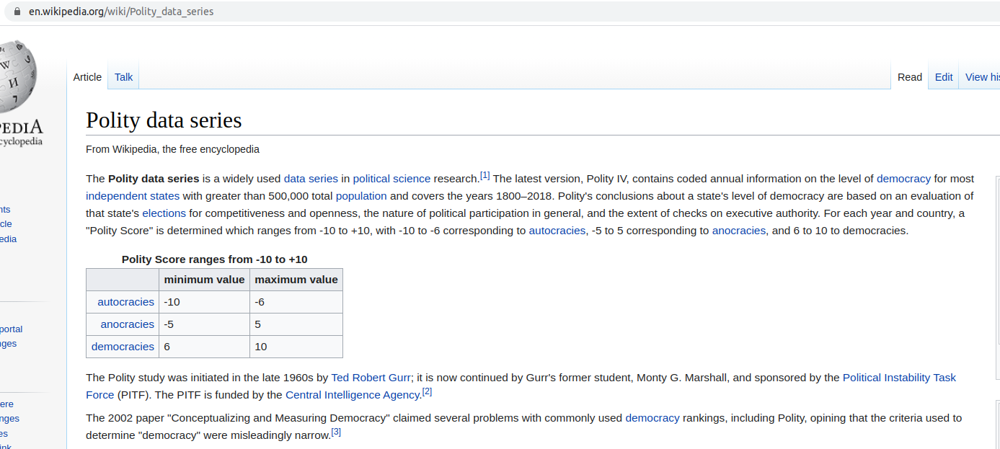
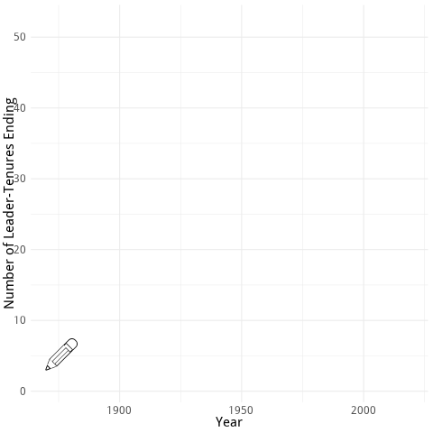

class: inverse
background-image: url("img/PicAnimNew.gif")

## Visualising Leaders: Archigos meets ggplot

```{r setup, include=FALSE, message=FALSE, warning=FALSE}
options(htmltools.dir.version = FALSE, warning=FALSE, message=FALSE, fig.retina = 3)
knitr::opts_chunk$set(fig.width = 8, message = FALSE, warning = FALSE, comment = "", cache = FALSE, fig.retina = 3)
library(widgetframe)
library(magrittr)
library(ggrepel)
library(haven)
library(tidyverse)
library(osmdata)
library(sf)
library(ggmap)
library(emojifont)
library(kableExtra)
library(OpenStreetMap)
library(lubridate)
library(utf8)
library(emoGG)
library(ggthemes)
library(janitor)
library(ggridges)
library(viridis)
library(ggrepel)
library(ggmosaic)
library(gridExtra)
library(here)
library(wordcloud2)
library(gganimate)
library(flipbookr)
library(hrbrthemes)
library(survival)
library(ggkm)
library(extrafont)
library(patchwork)
library(xaringanthemer)
```

---
class:inverse

# Leadership Studies

**What makes leaders effective?**

--

If you have in this in your bag of tricks, people will usually follow.


  
--

**The rest of us need data to drive decisions.**<sup>*</sup>

.footnote[
<sup>*</sup> The code libraries can be sourced via: `source(url("https://rww.science/talk/DS-Archigos/code/TalkSetup.R"))`.
]

---
class: inverse

## Insights from the past

There are at least two core problems:  
1. Systematic data are lacking as are systematic evaluations.  
--
  
2. Counterfactual problems are paramount.  
     + *One leader at a time.*


---
class: inverse

# What do Leaders Want?  
--

### To lead or equivalently: keep their jobs  
--

1. The tenure of leaders
2. How do they enter?  
3. How do they exit?  
4. Age and Sex

---
class: BounceIn

# The Data
# Archigos: A Database of National Leaders

Chiozza, Gleditsch, and Goemans have collected and maintained an encyclopedia of world leaders since the 1870s.<sup>1</sup>

--
- Leader spells are units

--
- Nested in countries

--
- Entry and exit including types

--
- Real date formats `r emo::ji("frowning_woman")`

```{r}
Archigos <- read_dta(url("http://www.rochester.edu/college/faculty/hgoemans/Archigos_4.1_stata14.dta"))
Archigos <- Archigos %>% mutate(leader = utf8_encode(leader))
```

.footnote[
<sup>1</sup> Archigos [on the web](http://www.ksgleditsch.com/archigos.html).
]

---
## The Key Quantity

Probability of survival given time in office can be written as:

$$ Pr(Survive|t) = \frac{\textrm{Number Surviving at t+1}}{\textrm{Risk set at t}}  $$

Basically, the number of failures only considering those that have survived number of years.

---
class: inverse

## A Note on Time

Time is a year without a calendar reference.

---

## Creating Tenure and a View

```{r ArchData, results="asis"}
Archigos %<>% mutate(tenure = as.duration(eindate %--% eoutdate)) %>% # Create duration for each spell  
  mutate(tenureY = tenure / dyears(1))    # Measure duration in years.
Archigos %>% head() %>% kable(., format="html") %>% kable_styling() %>% scroll_box(width = "800px", height = "400px")
```

---
### If leaders maximize time in office, the `league table`...

```{r, echo=FALSE}
WCdata <- Archigos %>% group_by(leader) %>% summarise(TenC = sum(tenureY)) %>% arrange(desc(TenC))
WCC <- WCdata %>% mutate(word=leader, freq=TenC) %>% wordcloud2(data=., color="random-dark", rotateRatio = 1, size=0.4)
frameWidget(WCC)
```


---
class: right
background-image: url("img/TenureBack.svg")
background-size: contain

# Leadership tenure
## How long do leaders stay in office?


---
class: inverse

## A Random Leader Survives How Long?

```{r, echo=FALSE, message=FALSE, warning=FALSE}
ArchB <- Archigos %>% mutate(ccode = as.integer(ccode), BYear = year(eindate)) %>% left_join(., countrycode::codelist_panel, by = c("ccode" = "cown", "BYear" = "year")) %>% mutate(Censored = 1-as.numeric(posttenurefate %in% c("Missing: Left Office after 2014-12-31","Leader Still in Office")))
ggplot(ArchB, aes(time = tenureY, status = Censored)) + 
  geom_km() + labs(title="Probability of Survival", color="Gender", x="Time in Years") + theme_minimal(base_size = 24)
```

---
# Most Don't Do So Well

```{r}
ArchB %>% filter(tenureY < 5) %>% ggplot(., aes(x=tenureY)) + geom_histogram(fill = "magenta") + theme_minimal(base_size = 24) + labs(title="Tenure under Five Years", x = "Tenure in Years")
```


---

# By Continent    

```{r, message=FALSE, warning=FALSE, echo=FALSE, fig.width=8}
ArchB %>% ggplot(., aes(time = tenureY, status = Censored, color = factor(continent))) + geom_km() + labs(color="Continent", title="Probability of Survival by Continent", x="Time in Years") + theme_minimal(base_size = 24)
```

---

# By Gender

```{r, echo=FALSE, warning=FALSE, message=FALSE, fig.width=8}
ggplot(ArchB, aes(time = tenureY, status = Censored, color = factor(gender))) + geom_km() + labs(title="Probability of Survival by Gender", color="Gender", x="Time in Years") + theme_minimal(base_size = 24)
```

---
class: right
background-image: url("img/BG2.svg")
background-size: contain

# Leadership tenure
## How long do leaders stay in office?

--

## Some caveats

Who counts?  
What about term limits?  
[The Polity Project](https://www.systemicpeace.org/inscrdata.html) measures characteristics of political regimes.

```{r, echo=FALSE, warning=FALSE, message=FALSE, results='hide'}
Polity <- readxl::read_excel("/home/rob/Downloads/p4v2018.xls")
Polity %>% mutate(GovType = as.character(NA))
Polity$GovType[Polity$polity > -11 & Polity$polity < -4] <- "Autocracy"
Polity$GovType[Polity$polity > -5 & Polity$polity < 6] <- "Anocracy"
Polity$GovType[Polity$polity > 5 & Polity$polity < 11] <- "Democracy"
Polity$GovType[Polity$polity > -90 & Polity$polity < -50] <- NA
PolArch <- left_join(ArchB, Polity, by = c("ccode" = "ccode", "BYear" = "year"))
```

---
class: inverse

## Classifying Regimes



---
class: inverse

## Based on These Elements
  
1. Regulation of Chief Executive Recruitment   
 + XRCOMP Competitiveness of Executive Recruitment  
 + XROPEN Openness of Executive Recruitment   
2. The Independence of Executive Authority   
 + XCONST Executive Constraints (Decision Rules)  
3. Political Competition and Opposition   
 + PARREG Regulation of Participation   
 + PARCOMP The Competitiveness of Participation   

---
class: inverse

## The Distribution of Regimes

```{r, warning=FALSE, message=FALSE, echo=FALSE}
PolArch %>% ggplot(., aes(x=GovType, fill=GovType)) + geom_bar() + theme_minimal(base_size = 24) + labs(x="", fill="Regime Type")
```

---

### Survival by Government Type

```{r}
ggplot(PolArch, aes(time = tenureY, status = Censored, color = factor(GovType))) + geom_km() + labs(title="Survival by Government Type", color="Type") + theme_minimal(base_size = 24)
```

---

## Shown by Tenure

```{r, echo=FALSE, fig.width=10}
GA <- PolArch %>% ggplot(., aes(y=tenureY, x=GovType, fill=GovType)) + geom_violin(alpha=0.3) + theme_minimal(base_size = 24) + labs(y="Tenure in Years", fill="Regime Type", x="Regime Type") + guides(fill=FALSE)
GB <- PolArch %>% ggplot(., aes(x=tenureY, fill=GovType)) + geom_histogram() + theme_minimal(base_size = 24) + labs(y="Count", fill="Regime Type", x="Tenure (in years)") + facet_wrap(vars(GovType)) + guides(fill=FALSE)
GA + GB
```

---

## 19th vs. 20th Century?

```{r, echo=FALSE}
PolArch %>% mutate(Twentieth.Century = (BYear > 1899)) %>% ggplot(., aes(time = tenureY, status = Censored, color = factor(Twentieth.Century))) + geom_km() + labs(title="Survival by Century", color="20th Century?") + theme_minimal(base_size = 24)
```

---

## Not Much Difference by Century Given Type

```{r, echo=FALSE}
PolArch %>% mutate(Twentieth.Century = (BYear > 1899)) %>% ggplot(., aes(y=tenureY, x=Twentieth.Century, fill=Twentieth.Century)) + geom_violin(alpha=0.3) + theme_minimal(base_size = 24) + labs(x="20th Century?", y="Tenure (in years)") + facet_wrap(vars(GovType)) + guides(fill=FALSE)
```

---

## Not Much Difference by Century Given Type

```{r, echo=FALSE}
PolArch %<>% 
  mutate(Twentieth.Century = (BYear > 1899), Age = BYear - as.numeric(yrborn))
PolArch %>%
  filter(Age < 125) %>%
  ggplot(., aes(x=Age, fill=Twentieth.Century))  + geom_density(alpha=0.3) + theme_minimal(base_size = 24) + labs(x="Age at Start of Spell")
```


---
class: inverse, center, middle

# How do leaders enter?

```{r Entry, include=FALSE, eval=FALSE}
Archigos %>% 
  tabyl(entry) %>% 
  ggplot(., aes(x=fct_reorder(entry, n), y=n, fill=entry)) + 
  geom_col() + 
  theme_minimal(base_size = 24) + 
  coord_flip() +
  scale_fill_viridis_d() + 
  guides(fill=FALSE) + 
  labs(y="Count of Spells", title="How do Leaders Enter?", x="") 
```

`r flipbookr::chunk_reveal("Entry")`

---
# Most Enter Regularly

```{r Enter2, echo=FALSE}
Archigos %>% 
  tabyl(entry) %>% 
  ggplot(., aes(x=fct_reorder(entry, n), y=n, fill=entry)) + 
  geom_col() + 
  coord_flip() +
  theme_minimal(base_size = 24) + 
  scale_fill_viridis_d() + 
  guides(fill=FALSE) + 
  labs(y="Count of Spells", title="How do Leaders Enter?", x="") 
```

---
# Survival Given Entry

```{r, echo=FALSE}
ggplot(PolArch, aes(time = tenureY, status = Censored, color = factor(entry))) + geom_km() + labs(title="Survival by Entry Method", color="Entry") + theme_minimal(base_size = 24)
```

---
## Split Entry by Century

```{r TableEnt, include=FALSE}
PolArch %>% 
  mutate(Twentieth.Century = (BYear > 1899)) %>% 
  tabyl(entry, Twentieth.Century) %>%  #BREAK
  adorn_percentages("col") #BREAK
```

`r chunk_reveal("TableEnt", break_type = "user")`

---
# Survival Given Entry and Century

```{r, echo=FALSE}
PolArch %>% 
  mutate(Twentieth.Century = (BYear > 1899)) %>% 
  mutate(Entry.Cent = as.factor(paste(entry,as.numeric(Twentieth.Century+19), sep=":"))) %>% 
  ggplot(., aes(time = tenureY, status = Censored, color = factor(Entry.Cent))) + geom_km() + labs(title="Survival by Entry Method", color="Entry:Century") + theme_minimal(base_size = 24)
```

---
## Age at Entry

```{r}
PolArch %>% filter(Age < 130) %>% ggplot(., aes(x=entry, y=Age, fill=entry)) + geom_violin() + scale_fill_viridis_d() + labs(title="Age at Entry", x="", y="Age (years)") + guides(fill=FALSE) + theme_minimal(base_size = 24)
```


---
class: middle, inverse, center

# Entry and Exit

---
## A Table

```{r EntEx}
MyTab <- PolArch %$% table(exit, entry)
MyTab
```
---

```{r, echo=FALSE}
MyTab %>% 
    data.frame() %>%
  ggplot(., aes(x=entry, y=exit, fill=Freq)) + 
  geom_tile() + 
  theme_minimal(base_size = 24) + 
  scale_fill_viridis_c() + 
  labs(y="", title="How do Leaders Enter and Exit?", x="") 
```

---
class:inverse

```{r, echo=FALSE}
Archigos %>% ggplot(., aes(x=entry,y=exit)) + geom_count(color="purple") + labs(x="How did the Leader Enter?", y="How did the Leader Exit?", title="Leader Entry and Exit by Spell") + theme_minimal(base_size = 24)
```

---
## Conditional Probability of Exit Given Entry?

```{r, echo=FALSE}
PolArch %$% table(exit, entry) %>% prop.table(., margin=2) %>% data.frame() %>% 
  ggplot(., aes(x=entry, y=exit, fill=Freq)) + 
  geom_tile() + 
  theme_minimal(base_size = 24) + 
  scale_fill_viridis_c() + 
  labs(title="Probability of Exit Given Entry?") 
```

```{r, eval=FALSE, echo=FALSE, fig.width=9, fig.height=5, message=FALSE}
# This is a background image
p1 <- Archigos %>% mutate(tenureY = floor(tenureY)) %>% tabyl(., tenureY) %>% ggplot(data=.) + geom_point(aes(x=tenureY, y=n)) + labs(x="Tenure in Years", y="Count of Leader Spells") + theme_economist() + geom_text(data = data.frame(x = 8.6, y = 353.384518517349, 
    label = "I am four years"), mapping = aes(x = x, y = y, label = label), inherit.aes=FALSE) + geom_text(data = data.frame(x = 12.6, y = 110, 
    label = "I am eight years"), mapping = aes(x = x, y = y, label = label), inherit.aes=FALSE)
p2 <- Archigos %>% mutate(tenureY = floor(tenureY)) %>% tabyl(., tenureY) %>% ggplot(data=.) + geom_point(aes(x=tenureY, y=percent)) + labs(x="Tenure in Years", y="Percent of Leader Spells") + theme_economist_white()
B3 <- grid.arrange(p1,p2)
ggsave(B3, file="img/BG2.svg", height=8, width = 10, units = "in")
```

---
## Entry and Type

```{r, echo=FALSE}
PolArch %>% mutate(Combo = paste(entry,GovType, sep=":")) %>%  
  ggplot(., aes(time = tenureY, status = Censored, color = factor(entry))) + geom_km() + labs(title="Survival by Entry Method and Type", color="Entry") + theme_minimal(base_size = 24) + facet_wrap(vars(GovType))
```
---
# Autocrats Last Longest

But...

```{r FinalTab, echo=FALSE}
PolArch %$% 
  prop.table(table(exit,GovType), margin=2) %>% 
  data.frame() %>% 
  ggplot(., aes(x=GovType, y=exit, fill=Freq)) + geom_tile() + scale_fill_viridis_c() + labs(x="", y="Exit Method", title="Regime Type and Method of Exit")
```

---
class: inverse
# That's Timely
Opportunities are on the rise.




---
### Opportunities Abound for Females

```{r}
Archigos %>% ggplot(aes(x=eindate, color=gender)) + geom_density() + theme_ipsum_rc()
```


---
class: bottom
background-image: url("img/PicAnimNew.gif")
background-position: 65% 8%


# Thanks!

Slides created via the R package [**xaringan**](https://github.com/yihui/xaringan).

[The shiny](https://s8.sytes.net/shiny/ArchigosDT)

Theme borrowed from `@apreshill` and her `r-ladies` theme.

