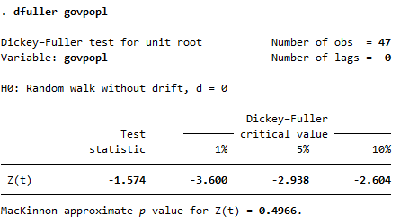
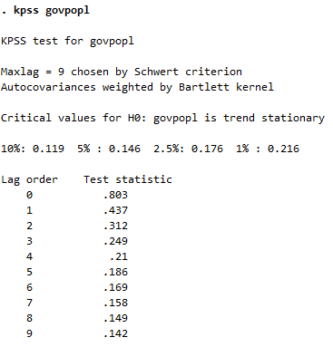
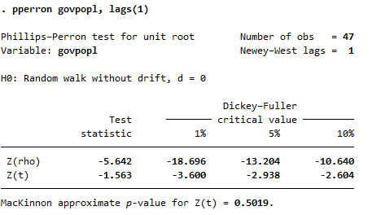

```{r setup, include=FALSE}
options(htmltools.dir.version = FALSE)
knitr::opts_chunk$set(
  fig.width=9, fig.height=3.5, fig.retina=3,
  out.width = "100%",
  cache = FALSE,
  echo = TRUE,
  message = FALSE, 
  warning = FALSE,
  hiline = TRUE
)
```

```{r xaringan-themer, include=FALSE, warning=FALSE}
knitr::opts_chunk$set(warning=FALSE, message=FALSE, comment=NA, prompt=FALSE, fig.height=6, fig.width=6.5, fig.retina = 3, dev = 'svg', dev.args = list(bg = "transparent"))
library(xaringanthemer); library(kableExtra); library(tidyverse); library(skimr)
# style_mono_accent(
style_duo_accent(
#style_solarized_light(
primary_color = "#371142", 
# header_color = "#ffffff",
          secondary_color = "#1c5253", 
          text_bold_color = "#FF00FF",
          link_color = "#F97B64",
          text_font_google   = google_font("EB Garamond"),
          code_font_google   = google_font("Fira Mono")
)
```

```{css, echo = FALSE, include=FALSE}
.remark-slide-content p, il, ol, li {
  font-size: 32px;
  padding: 8px 16px 8px 16px;
}
code.r{
  font-size: 18px;
}
pre {
  font-size: 24px;
}
.red { 
  color: red; 
}
.green { 
  color: green; 
}
```

## Outline for Day 2

**Big picture: Models for Single Time Series**

- Stationarity and differencing
- Spurious regressions: Yule (1926)
- Autoregressive and moving average terms.
- Unit-root testing
- Event Studies
- The model/substance interaction

---

## Stationarity Issues

- Essence of stationarity is threefold: means, variances, and crosses are not time-dependent.
- There is a quite famous spurious regressions result in econometrics that owes to the statistician Yule in 1926.
- Basically, the regression of $I(1)$ series on one another has non-$\alpha$ rejection rates.
- Applied to panels, a mix of orders of integration will give $t$ statistics non-$t$ properties.
- In the end, I suspect the best advice is to partition data on the basis of likely orders of integration and proceed from there.

---

## Differencing
In the case of integer orders of integration, the widely available and simple solution is to take sufficient differences to render the variable stationary.  If the levels are not stationary, try changes; if changes are non-stationary, try the change in change.  And so on.  But differencing has rather pernicious substantive consequences.

---

## Autocorrelation

When discussing heteroscedasticity, we notice that the off-diagonal elements are all zeroes.  This is the assumption of no correlation among [somehow] adjacent elements.  The somehow takes two forms: (1) spatial and (2) temporal.  Just as before where time-induced heteroscedasticity simply involved interchanging $N$ and $T$ and $i$ and $t$; the same idea prevails here.

---

## Stationarity and the I: Integration

The basic idea: time-consistency.  James D. Hamilton *Time Series Analysis* defines two notions of stationarity.

- Strict stationarity: A process is said to be strictly stationary if, for any values of $j_{1},j_{2},\ldots,j_{n}$ the joint distribution of $Y_{t},Y_{t+j_{1}},Y_{t+j_{2}},\ldots,Y_{t+j_{n}}$ depends only on the intervals separating the dates ( $j_{1},j_{2},\ldots,j_{n}$ ) and not on the date itself $t$.

- Weak stationarity: If neither the mean $\mu$, nor the autocovariances $\gamma_{j}$, depend on the date $t$, then the process for $Y_{t}$ is said to be covariance-stationary or weakly stationary.
$$\mathbb{E}[(Y_{t})] = \mu \; \forall \; t$$
$$\mathbb{E}[(Y_{t} - \mu)(Y_{t-j} - \mu)] = \gamma_{j}\; \forall t\; [any]\; j$$

---

## Why It Matters?

Everything is calculated from deviates: $y_{i} - \overline{y}$

We assume *stationarity* in so doing.  **And we do so at our peril.**

---

## A Simple Example

Let's examine a simple form of first-order dependence.  Let's suppose that the current observation depend on the immediately prior observation by some elasticity $\rho$.  Let $\epsilon_{t} \sim N(0,\sigma_{\epsilon}$)  This yields:

$$y_{t} = \alpha + \rho_{1}y_{t-1} + \epsilon_{t}$$

One sufficient condition for stationarity would be that $abs(\rho) < 1$ -- we will see this again shortly.  Why?  Suppose it is one.

$$y_{t}  =  \alpha + \rho_{1}y_{t-1} + \epsilon_{t}$$
$$y_{t} - y_{t-1}  =  \alpha +  \epsilon_{t}$$

The over time difference in y is a constant plus a well-behaved error.  This is known as a **random walk with drift**.

It is worth stopping to think about a drawing.  The problem can be approached with the difference in $y$ on the left hand side.  But, keeping in mind that $\epsilon$ has zero expectation, this will grow or shrink endlessly by virtue of $\alpha$.  **The mean is a function of time for levels of the series**.

---

## Yule and Spurious Regressions

Lets have a look at a [little simulation](https://ESSSSDA22-3K.netlify.app/posts/spurious-regressions/)

As you see, this applies to non-stationary series.  But not everything with dependency through time is non-stationary.  ARMA process provide the middle ground while the I -- the order of integration -- in ARIMA relates to required differences for stationarity.

---

## The Managable Autocorrelation Structure

In linear algebra, a Toeplitz matrix has the descending diagonal from left to right as a constant.  They have some handy properties but expose some key underlying properties.

$$\Phi = \sigma^{2}\Psi = \sigma^{2}_{e}  \left(\begin{array}{ccccc}1 & \rho_{1} & \rho_{2} & \ldots & \rho_{T-1} \\ \rho_1 & 1 & \rho_1 & \ldots & \rho_{T-2} \\ \rho_{2} & \rho_1 & 1 & \ldots & \rho_{T-3} \\ \vdots & \vdots & \vdots & \ddots & \vdots \\ \rho_{T-1} & \rho_{T-2} & \rho_{T-3} & \ldots & 1 \end{array}\right)$$

This allows us to calculate the variance of $e$ using results from math stats, for a first-order autoregressive process we would have $e_{t} = \rho e_{t-1} + \nu_{t}$ s.t. $Var(e_{t}) = \rho^{2}Var(e_{t-1}) + Var(\nu)$.  If the variance is stationary, we can rewrite,
$$\sigma^{2}_{e} = \frac{\sigma^{2}_{\nu}}{1 - \rho^{2}}$$

---

## Three Standard Time-Serial Structures [ARMA]

Auto Regressive Moving Average (ARMA) structures characterize most time series of interest (virtually all with the inclusion of their seasonal counterparts).  In general, we write

- Autoregression [AR(p)]: $$e_{t} = \rho_{1} e_{t-1} + \rho_{2}e_{t-2} + \cdots + \rho_{p} e_{t-p} + \nu_{t}$$

- Moving Average [MA(q)]: $$e_{t} = \nu_{t} + \theta_{1} \nu_{t-1} + \theta_{2}\nu_{t-2} + \cdots + \theta_{p} \nu_{t-q}$$

- Autoregression and Moving Average [ARMA(p, q)]: $$e_{t} = \rho_{1} e_{t-1} + \rho_{2}e_{t-2} + \cdots + \rho_{p} e_{t-p} + \nu_{t} + \theta_{1} \nu_{t-1} + \theta_{2}\nu_{t-2} + \cdots + \theta_{q} \nu_{t-q}$$

---

.left-column[One way of getting a handle on this is to attempt to measure it.  [From the inimitable Allison Horst....](https://twitter.com/allison_horst/status/1361545021980217345?lang=en)
]
.right-column[<blockquote class="twitter-tweet"><p lang="en" dir="ltr">A new series to introduce the autocorrelation function (ACF) w/ time series data, with special thanks to <a href="https://twitter.com/robjhyndman?ref_src=twsrc%5Etfw">@robjhyndman</a> for feedback &amp; suggestions! 👾<br><br>🧵1/9: Meet the monster family. The youngest generation is on the right (that&#39;s our host). <a href="https://t.co/9iBtV88KfU">pic.twitter.com/9iBtV88KfU</a></p>&mdash; Allison Horst (@allison_horst) <a href="https://twitter.com/allison_horst/status/1361545021980217345?ref_src=twsrc%5Etfw">February 16, 2021</a></blockquote> <script async src="https://platform.twitter.com/widgets.js" charset="utf-8"></script>
]
---

## ACF and PACF

Two relevant autocorrelations: 

- Autocorrelation: $$\rho_{s} = \frac{\sum^{T}_{t=s+1} (y_{t} - \overline{y})(y_{t-s} - \overline{y})}{\sum_{t=1}^{T}(y_{t} - \overline{y})^{2}}$$

- Partial Autocorrelation $$\phi_{s} = \frac{\rho_{s} - \sum_{j=1}^{s-1} \phi_{s-1,j}\rho_{s-j}}{1 - \sum_{j=1}^{s-1} \phi_{s-1,j}\rho_{j}}$$


In ARIMA modeling, these are two critical components as each process has a characteristic signature.  An autoregressive process typically exhibits geometric decay in the autocorrelation function and spikes in the partial; moving average processes exhibit the reverse.  Nonstationary series decay very slowly (the $I$ in ARIMA).

---
class:inverse

### Code to play with

This is an AR(1) with $\rho=0.9$.

```
library(tidyverse)
library(fpp3)
data.frame(y=arima.sim(list(ar=0.9, ma=0), n=100, n.start = 50), x=seq(1:100)) %>% as_tsibble(index=x) %>% gg_tsdisplay(plot_type="partial")
```

---
### (1[0.9],0,0)

```{r, echo=FALSE, fig.width=6, fig.height=3}
data.frame(y=arima.sim(list(ar=0.9, ma=0), n=100, n.start = 50), x=seq(1:100)) %>% as_tsibble(index=x) %>% gg_tsdisplay(plot_type="partial")
```

---
### (0,0,1[0.9])

```{r, echo=FALSE, fig.width=6, fig.height=3}
data.frame(y=arima.sim(list(ma=0.9, ar=0), n=100, n.start = 50), x=seq(1:100)) %>% as_tsibble(index=x) %>% gg_tsdisplay(plot_type="partial")
```

---

### (1[-0.9],0,0)

```{r, echo=FALSE, fig.width=6, fig.height=3}
data.frame(y=arima.sim(list(ar=-0.9, ma=0), n=100, n.start = 50), x=seq(1:100)) %>% as_tsibble(index=x) %>% gg_tsdisplay(plot_type="partial")
```


---
### (0,0,1[-0.9])

```{r, echo=FALSE, fig.width=6, fig.height=3}
data.frame(y=arima.sim(list(ma=0.9, ar=0), n=100, n.start = 50), x=seq(1:100)) %>% as_tsibble(index=x) %>% gg_tsdisplay(plot_type="partial")
```

---
### (0,1,0)

```{r, echo=FALSE, fig.width=6, fig.height=3}
URDF <- data.frame(y=arima.sim(list(order=c(0,1,0)), n=100, n.start = 50), x=seq(1:101)) 
URDF %>% as_tsibble(index=x) %>% gg_tsdisplay(plot_type="partial")
```

---
class:inverse 

### Differencing

```{r, echo=FALSE, fig.width=6, fig.height=3}
URDF %>% mutate(D.y = difference(y, lag=1)) %>% as_tsibble(index=x) %>% gg_tsdisplay(D.y, plot_type="partial")
```

---

## Stata

Though these plots were generated in $R$, we could do the same thing in Stata.  For a quick summary with a little graphic, have a look at the `corrgram`.  For (pretty) plots, Stata has two commands to recreate this, `ac` and `pac`.  The former generates the autocorrelations while the latter creates the partial autocorrelations.  We will have a go at this in the lab.

---

## Dickey-Fuller tests

The Dickey-Fuller testing philosophy relies on the following base equation that mirrors our earlier basic presentation of random walks.  To obtain a test equation, subtract $y_{t-1}$ from both sides.


$$y_{t}  =  \alpha + \beta t + \rho_{1}y_{t-1} + \epsilon_{t}$$
--

$$\Delta(y_{t})  =  \alpha  + \beta t + (\rho_{1}-1)y_{t-1}+  \epsilon_{t}$$
--

The $\alpha$ -- drift -- and $\beta$ -- trend -- terms are optional depending on the series in question.  If and only if $\rho - 1 < 0$ or $\rho < 1$ can we reject the claim of nonstationarity.

The critical values are tabulated.

---

.pull-left[
### Stata

```
use "https://github.com/robertwwalker/Essex-Data/raw/main/br7983.dta"
tsset
dfuller govpopl
```


]
.pull-right[
### R
```{r, echo=FALSE}
library(urca)
load(url("https://github.com/robertwwalker/Essex-Data/raw/main/br7983.RData"))
ur.df(br7983$govpopl, type="drift", lags=0)
```
]

---

## KPSS

Is unique in having a null hypothesis of [trend/drift/trend and drift] stationary.  It is also fairly easy to construct.

--

- Regress $y$ on the chosen option above [trend/drift/trend and drift] and isolate the residual $u$.

--

- Calculate $S_{t}$, the partial sum of the residuals: $$S_{t} = \sum_{i=1}^{t} u_{i}$$

--

- The KPSS statistic is $$KPSS = \frac{1}{T^2} \sum{t=1}^{T} \frac{S_{t}}{s_{u^2}}$$ where $s_{u^2}$ is an estimate of the long-run variance (typically done by a Newey-West procedure).

--

- If KPSS is large, reject the claim of *** stationary.

**The critical values are tabulated.**

---

.pull-left[
### Stata

You will have to find `kpss`; trend is default.

```
kpss govpopl
```

]
.pull-right[
### R

```{r}
urca::ur.kpss(br7983$govpopl, type="tau", use.lag = 0)
```

]

---

## Perron

- A stationary time-series may look like non-stationary when there are structural breaks in the intercept or trend.

--

- The unit root tests lead to false non-rejection of the null when we do not consider the structural breaks. A low power problem.

--

- A single known breakpoint in 1987, Perron extended it to a case of unknown breakpoint in the 1990s.

--

- Perron considers the null and alternative hypotheses

H0: $y_{t} = a_{0} + y_{t-1} + \mu_{1} D_{P} + \epsilon_{t}$ so that
$y_{t} \sim S$ with a jump

H1: $y_{t} = a_{0} + a_{2} t + \mu_{2} D_{L} + \epsilon_{t}$ so that
$y_{t} \sim TS$ with a jump


Pulse break: $D_P = 1 \; if \; t = TB + 1$ and zero otherwise,

Level break: $D_L = 0 \;for \; t = 1, . . . , TB$ and one otherwise.

---
.pull-left[
### Stata

```
pperron govpopl, lags(1)
```


]


.pull-right[
### R

```{r}
ur.pp(br7983$govpopl, model="constant", use.lag=1)
```

]

---

## TSCS and Time Series

- Common structure restrictions may be difficult to deal with and limit our ability to gain much from combining individual time series.
- Most will be pretty simple structures.
- Mixed orders of integration present special problems.

---

### Diagnosing Serial Correlation Individually

If we can reject a range of pathologies, we can justify inference rationally?  **The integrity of the estimand; does the conditional mean make sense?**  
- Unit root tests come in a host of forms with nulls of a unit root and nulls of stationarity.  The processes have different implications. 
      - Levin and Lin: `levinlin` with $H_{0}: I(1)$.
      - Im, Pesaran, and Shin: `ipshin` with $H_{0}: I(1)$.
      - KPSS: `kpss` with $H_{0}: I(0)$.
      - Fisher: `xtfisher` works with unbalanced panels
      - Simple `xtreg` with lagged $y$, if $\beta_{y_{t-1}} \approx 1$ then there is a worry.
      - Plots (Every structure has different theoretical ACF/PACF)
      - Durbin-Watson $d$ and Durbins $h$ with endogenous variables
      - Dickey-Fuller tests and many others. $\Delta y_{t} = \rho y_{t-1} + \theta_{L} \Delta y_{t-L} + \lambda_{t} +  u_{t}$
      - Breusch-Godfrey test and the like (Fit regression, isolate residuals, regress residual on $X$ and lags of residual, $nR^{2} \sim \chi^{2}_p$).

- The above alongside: 
      1. is the temporal process common or distinct? and  
      1. if distinct, how and why?

---

## Panel Unit Root Testing

Stata has a battery of panel unit-root tests.  There are many and they operate under differing sets of assumptions.  They generally follow on `xtunitroot`.

- Levin-Lin-Chu (`xtunitroot llc`): trend nocons (unit specific) demean (within transform) lags.  Under (crucial) cross-sectional independence, the test is an advancement on the generic Dickey-Fuller theory that allows the lag lengths to vary by cross-sections.  The test relies on specifying a kernel (beyond our purposes) and a lag length (upper bound).  The test statistic has a standard normal basis with asymptotics in $\frac{\sqrt{N_{T}}}{T}$ ($T$ grows faster than $N$).  The test is of either all series containing unit roots ($H_{0}$) or all stationary; this is a limitation.  It is recommended for moderate to large $T$ and $N$.
    + Perform separate ADF regressions: $$\Delta y_{it} = \rho_{i} \Delta y_{i,t-1} + \sum_{L=1}^{p_i} \theta_{iL} \Delta y_{i,t=L} + \alpha_{mi}d_{mt} + \epsilon_{it}$$ with $d_{mt}$ as the vector of deterministic variables (none, drift, drift and trend).  Select a max $L$ and use $t$ on $\hat{\theta}_{iL}$ to attempt to simplify.  Then use $\Delta y_{it} = \Delta y_{i,t-L}$ and $d_{mt}$ for residuals 

---

- Harris-Tzavalis (`xtunitroot ht`):  trend nocons (unit specific) demean (within transform) altt (small sample adjust)
    + Similar to the previous, they show that $T \rightarrow \infty$ faster than $N$ (rather than $T$ fixed) leads to size distortions.
- Breitung (`xtunitroot breitung`):  trend nocons (unit specific) demean (within transform) robust (CSD) lags. \\ Similar to LLC with a common statistic across all $i$.
- Im, Pesaran, Shin (` ips`):  trend demean (within transform) lags.  They free $\rho$ to be $\rho_{i}$ and average individual unit root statistics.  The null is that all contain unit roots while the alternative specifies at least some to be stationary.  The test relies on sequential asymptotics (first T, then N).  Better in small samples than LLC, but note the differences in the alternatives.

--

- Fisher type tests (`xtunitroot fisher`): dfuller pperron demean lags.
- Hadri (LM) (`xtunitroot hadri`): trend demean robust 

**All but the last are null hypothesis unit-root tests.**  Most assume balance but the fisher and IPS versions can work for unbalanced panels.

---

## Language of Time Series

**Trend**: pattern exists when there is a long-term increase or decrease in the data.

**Seasonal**: pattern exists when a series is influenced by seasonal factors (e.g., the quarter of the year, the month, or day of the week).

**Cyclic**: pattern exists when data exhibit rises and falls that are \emph{not of fixed period} (duration usually of at least 2 years).

---

## Visuals: Seasonal plots


- Data plotted against the individual "seasons" in which the data were observed.  (In this case a "season" is a month.)
- Something like a time plot except that the data from each season are overlapped.
- Enables the underlying seasonal pattern to be seen more clearly, and also allows any substantial departures from the seasonal pattern to be easily identified.


---

```{r, fig.height=3, fig.width=6}
library(fpp3); library(tidyverse)
beer <- aus_production %>%
  select(Quarter, Beer) %>%
  filter(year(Quarter) >= 1992)
beer %>% autoplot(Beer) + hrbrthemes::theme_ipsum()
```

---

```{r, fig.height=3, fig.width=6}
beer %>% gg_season(Beer, labels="right") + hrbrthemes::theme_ipsum()
```

---

```{r, fig.height=3, fig.width=6}
beer %>% gg_subseries(Beer) + hrbrthemes::theme_ipsum()
```
