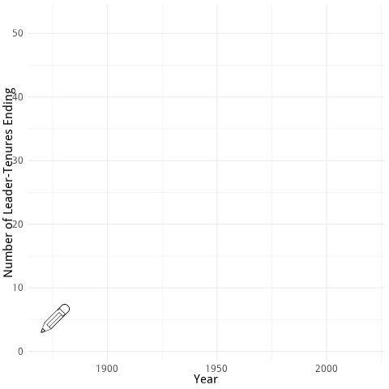

class: inverse
background-image: url("img/PicAnim.gif")

# Leaders and Grammar for Graphics

```{r setup, include=FALSE, message=FALSE, warning=FALSE}
options(htmltools.dir.version = FALSE, warning=FALSE, message=FALSE)
library(ggrepel)
library(haven)
library(tidyverse)
library(osmdata)
library(sf)
library(ggmap)
library(emojifont)
library(kableExtra)
library(OpenStreetMap)
library(lubridate)
library(utf8)
library(emoGG)
library(ggthemes)
library(janitor)
library(ggridges)
library(viridis)
library(ggrepel)
library(ggmosaic)
library(gridExtra)
library(here)
library(wordcloud2)
library(gganimate)
```

---

# A Grammar of Graphics

--
- data

--
- a mapping from data to aesthetics

--
- a geometry for representing the aesthetic


---
class: inverse

# My Primitive: A canvas

--
### Data as coordinates in 1 or 2-d with aesthetics and geometries

--
Graphics are generically flat; they are (at most) **two dimensional**.

That is caused by the screen.

--

**Our visuals must respect these limitations but we can add colors, shapes, and sizes,**
--
 or even emojis.  `r emo::ji("fire")`


---
class:inverse, center, middle, bounceIn, bounceOut

# The canvas: Every graphic fits here

```{r, echo=FALSE, fig.height = 5, fig.width = 7, fig.align = "center", dev="svg"}
plot(x=rnorm(100),y=rnorm(100), pch="", bty="n", xlab="x", ylab="y", xlim=c(-2,2), ylim=c(-2,2), axes=FALSE)
```


---
class: inverse, tada
# One Important Caveat

There is one notable and widely seen exception to this charaterization.  
Size is total tenure.<sup>1<sup>

```{r, eval=FALSE, echo=FALSE}
# wordcloud code; not run
Archigos <- Archigos %>% mutate(tenure = startdate %--% enddate)
Archigos <- Archigos %>% mutate(tenureY = year(enddate) - year(startdate))
WCdata <- Archigos %>% group_by(leader) %>% summarise(TenC = sum(tenureY)) %>% arrange(desc(TenC)
WCdata %>% mutate(word=leader, freq=TenC) %>% wordcloud2(data=., color="random-dark", rotateRatio = 1, size=0.4)
```

.footnote[

[1] The install script for the packages used is in the talk directory as `source(url("http://rww.science/talk/ggsc/PackagesUsed.R"))`.  The interested reader can issue `source(url("https://rww.science/talk/ggsc/XSCSetup.R"))`.

]

---
class: inverse,heartBeat

## The Illustration

What determines x and y?    **Nothing.**    
Coordinates are arbitrary.


---
class: inverse, center, middle

# A Simple Example to Cement our Thinking

--

[Where am I?](https://where-am-i.net)


---
# I am in Oregon
## Let's Start There

Get the map of Oregon and then use `ggmap` to map it.

```{r, warning=FALSE, message=FALSE, eval=TRUE}
OR_map <- get_map(getbb("Oregon"))
# ggmap(OR_map) 
```


---
class: inverse, wobble

## The Result

```{r, fig.height=5, fig.width=8, echo=FALSE, results='hide', warning=FALSE, message=FALSE}
ggmap(OR_map)
```


---
class: inverse

# Me as Data

For now, just my GPS coordinates.

```{r}
Me <- data.frame(lat=44.924943, lon=-123.043461)
```


---
# Mapping Me...

- Put my data on the earlier map.  
- My data is a set of coordinates that are already defined on the map.  
- Let's locate me on the map.

```{r, eval=FALSE}
Me <- data.frame(lat=44.924943, lon=-123.043461)
ggmap(OR_map) +
geom_emoji(data=Me, aes(y=lat, x=lon), emoji="1f4aa", size=0.125) + theme_nothing()
```

---
class: inverse
# Me on the Map

```{r, echo=FALSE, fig.width=8, fig.height=5}
ggmap(OR_map) + geom_emoji(data=Me, aes(y=lat, x=lon), emoji="1f4aa", size=0.1) + theme_nothing()
```

---
class: inverse, heartBeat

# Data Visualisation on the Canvas
## Showcasing the Language of Visuals with Data on National Leaders


---
# The Data
# Archigos: A Database of National Leaders

Chiozza, Gleditsch, and Goemans have collected and maintained an encyclopedia of world leaders since the 1870s.

--
- Leader spells are units

--
- Nested in countries

--
- Entry and exit including types

--
- Real date formats `r emo::ji("sad")`
```{r, eval=FALSE}
Archigos <- read_dta(url("http://www.rochester.edu/college/faculty/hgoemans/Archigos_4.1_stata14.dta"))
Archigos <- Archigos %>% mutate(leader = utf8_encode(leader))
kable(Archigos) %>%
  kable_styling() %>%
  scroll_box(width = "800px", height = "400px")
```


.footnote[
[1] Archigos [on the web](http://www.ksgleditsch.com/archigos.html).
]


---
## A Look

```{r, echo=FALSE}
library(haven)
Archigos <- read_dta(url("http://www.rochester.edu/college/faculty/hgoemans/Archigos_4.1_stata14.dta"))
Archigos <- Archigos %>% mutate(leader = utf8_encode(leader))
knitr::kable(head(Archigos)) %>%
  kable_styling() %>%
  scroll_box(width = "800px", height = "400px")
```


---
class: inverse, bottom,  bounceIn
background-image: url("img/WordCloudLeaders.jpeg")
background-size: 500px
background-position: 80% 8%


# One discrete variable: 
## Frequency [Barplot] or Probability [Mosaic]


--

```{r, eval=FALSE}
Archigos %>% ggplot(., aes(x=leader)) + 
  geom_bar(fill="#88398A") + 
  labs(x="Leader", y="Frequency", 
       title="The Frequency of Leaders", 
       subtitle = "Leaders had as many as six tenures")
```


---
class: inverse

## too many values of x make bad graphics


```{r, echo=FALSE, fig.height=4.5, fig.width=6}
Archigos %>% ggplot(., aes(x=leader)) + 
  geom_bar(fill="#88398A") + 
  labs(x="Leader", y="Frequency", 
       title="The Frequency of Leaders", 
       subtitle = "Leaders had as many as six tenures") +
  theme(axis.text.x=element_text(size=6))
```


---
class: inverse, hinge

## Show More than Three Spells


```{r, fig.height=6, fig.width=8}
Archigos %>% group_by(leader) %>% mutate(count = n()) %>% filter(count > 3) %>% ggplot(., aes(x=leader)) + geom_bar(fill="#88398A") + labs(x="Leader", y="Leadership Spells", title="The Frequency of Leaders", subtitle = "Leaders with more than three tenures") + coord_flip() + theme(axis.text.x = element_text(size=8))
```


---
class: inverse

# A Small Number of Categories Works Best

--

How did leaders enter?

```{r, fig.height=5, fig.width=8}
Archigos %>% ggplot(., aes(x=entry)) + geom_bar(fill="#88398A") + labs(title="How did the Leader Enter?", y="Count of Leaders", x="") + coord_flip()
```

---
class: inverse

# A Small Number of Categories Works Best

--

How did leaders enter? [Probability]

```{r, fig.height=3.5, fig.width=5}
Archigos %>% ggplot(.) + geom_mosaic(aes(x=product(entry), fill=entry)) + labs(title="How did the Leader Enter?", y="", x="", fill="Method of Entry")  + coord_flip()
```


---
class: inverse, center, middle, bounceOut

# One quantitative variable: Leadership tenure
## How long do leaders stay in office?

---
class: right
background-image: url("img/TenureBack.svg")
background-size: contain

# Visualising Tenure: One numeric variable


## choose a scale 
--

### connect points, create polygons, plot statistics

```{r, eval=FALSE, echo=FALSE, fig.width=9, fig.height=5, message=FALSE}
# This is the background image for this slide.
Archigos <- Archigos %>% mutate(tenureY = year(enddate) - year(startdate))
p1 <- Archigos %>% tabyl(., tenureY) %>% ggplot(data=.) + geom_point(aes(x=tenureY, y=n)) + labs(x="Tenure in Years", y="Count of Leader Spells") + theme_economist()
p2 <- Archigos %>% tabyl(., tenureY) %>% ggplot(data=.) + geom_point(aes(x=tenureY, y=percent)) + labs(x="Tenure in Years", y="Percent of Leader Spells") + theme_economist()
grid.arrange(p1,p2)
```


---
class: inverse

# One numeric variable:  
### Visualising Tenure

```{r, eval=FALSE}
Archigos <- Archigos %>% mutate(tenureY = year(enddate) - year(startdate))
plt1 <- Archigos %>% ggplot(., aes(tenureY)) + 
  {{ geom_area(stat="bin", bins=30, fill="#88398A") }} + labs(x="Tenure (in years)", y="Frequency", title="geom_area") + theme_economist_white()
plt2 <- Archigos %>% ggplot(., aes(tenureY))  +  
  {{ geom_density(, fill="#88398A") }} + labs(x="Tenure (in years)", y="Frequency", title="geom_density") + theme_economist_white()
plt3 <- Archigos %>% ggplot(., aes(tenureY)) + 
  {{ geom_histogram(, fill="#88398A") }} + labs(x="Tenure (in years)", y="Frequency", title="geom_histogram") + theme_economist_white()
plt4 <- Archigos %>% ggplot(., aes(tenureY)) +  
  {{ geom_dotplot(, fill="#88398A") }} + labs(x="Tenure (in years)", y="Frequency", title="geom_dotplot") + theme_economist_white()
grid.arrange(plt1,plt2,plt3,plt4)
```

---
class: inverse, rubberBand, center, middle

```{r, echo=FALSE, fig.height=5, fig.width=8, warning=FALSE, message=FALSE}
Archigos <- Archigos %>% mutate(tenure = startdate %--% enddate)
Archigos <- Archigos %>% mutate(tenureY = year(enddate) - year(startdate))
library(gridExtra)
plt1 <- Archigos %>% ggplot(., aes(tenureY)) + geom_area(stat="bin", bins=30, fill="#88398A") + labs(x="Tenure (in years)", y="Frequency", title="geom_area") + theme_economist_white()
plt2 <- Archigos %>% ggplot(., aes(tenureY))  + geom_density(fill="#88398A") + labs(x="Tenure (in years)", y="Frequency", title="geom_density") + theme_economist_white()
plt3 <- Archigos %>% ggplot(., aes(tenureY)) + geom_histogram(fill="#88398A") + labs(x="Tenure (in years)", y="Frequency", title="geom_histogram") + theme_economist_white()
plt4 <- Archigos %>%  ggplot(., aes(tenureY)) + geom_dotplot(fill="#88398A") + labs(x="Tenure (in years)", y="Frequency", title="geom_dotplot") + theme_economist_white()
grid.arrange(plt1,plt2,plt3,plt4)
```


---
class: inverse, zoomInDown

## Using the Percentiles Leads to a Boxplot

```{r, fig.height=5, fig.width=8, warning=FALSE, message=FALSE}
Archigos %>%  ggplot(., aes(y=tenureY)) +
  geom_boxplot(fill="#88398A") + labs(x="Tenure (in years)", y="Frequency", title="geom_boxplot") + theme_economist_white()
```


---
class: inverse, flash, middle, center

# Two Discrete Variables: 
## A Table

---

# How do leaders enter and exit?

```{r, warning=FALSE}
Archigos %>% tabyl(exit,entry)
Archigos %>% tabyl(exit,entry) %>% adorn_percentages("col") %>% adorn_pct_formatting()
```

---
class:inverse

# Visualizing Two Categorical Variables

--

The Table is more informative because the *geometry* obscures information.

```{r, fig.width=6, fig.height=4}
Archigos %>% ggplot(., aes(x=entry,y=exit)) + geom_count(color="purple") + labs(x="How did the Leader Enter?", y="How did the Leader Exit?", title="Leader Entry and Exit by Spell") + theme_economist()
```

---
class: inverse

## Geometries allow area (like maps) on a unit square

It is usually suggested to avoid pie charts because squares are hard enough.

```{r, warning=FALSE, message=FALSE, eval=FALSE, fig.width=10, fig.height=8}
library(ggmosaic)
ggplot(data=Archigos) + 
  geom_mosaic(aes(x = product(exit,entry), fill=exit)) + 
  labs(y="Method of Exit", x="Method of Entry", main="Entry and Exit by Leaders") + 
  theme_minimal() + guides(fill=guide_legend(title="Method of Exit")) +
  theme(axis.text.y =  element_text(size=8, hjust=0.25), axis.text.x =  element_text(size=8, angle=45, vjust=1), 
                          legend.text = element_text(size=10))
```


---
class: inverse, heartBeat


```{r, warning=FALSE, message=FALSE, echo=FALSE, fig.width=10, fig.height=8}
library(ggmosaic)
ggplot(data=Archigos) + geom_mosaic(aes(x = product(exit,entry), fill=exit)) + labs(y="Method of Exit", x="Method of Entry", main="Entry and Exit by Leaders") + theme_minimal() + guides(fill=guide_legend(title="Method of Exit")) + theme(axis.text.y =  element_text(size=8, hjust=0.25), axis.text.x =  element_text(size=8, angle=45, vjust=1), legend.text = element_text(size=10))
```

---
class: inverse

# Visualising Flows

An alluvial shows how individuals pass through shared system points.  For example, leaders enter, exit, and have some post tenure fate.  
```{r, fig.width=7, fig.height=5, echo=FALSE}
library(ggalluvial)
library(gridExtra)
allTable <- Archigos %>% group_by(gender, entry, exit, posttenurefate) %>% count() %>% ungroup()
allTable <- allTable %>% mutate(posttenurefate = as.factor(posttenurefate))
myplotM <- allTable %>% filter(gender=="M") %>% ggplot(.,
       aes(axis1 = entry,
           axis2 = exit,
           axis3 = posttenurefate,
           y = n)) +
  geom_alluvium(aes(fill = entry)) +
  geom_stratum() +
  geom_text(stat = "stratum", 
            label.strata = TRUE) +
#  scale_x_discrete(limits = c("Entry", "Gender", "Exit","Fate"),
#                   expand = c(.1, .1)) +
  scale_fill_viridis_d() +
  labs(title = "Archigos Leaders: Males",
       subtitle = "stratified by entry, exit and fate",
       y = "Frequency") +
  theme_minimal() +
  theme(legend.position = "none")
```


---
class: inverse

This needs work but I don't have a firm idea of how to collapse categories to improve readability.

```{r, fig.width=8, fig.height=6, echo=FALSE, warning=FALSE, message=FALSE}
library(ggalluvial)
library(gridExtra)
allTable <- Archigos %>% group_by(gender, entry, exit, posttenurefate) %>% count() %>% ungroup()
allTable <- allTable %>% mutate(posttenurefate = as.factor(posttenurefate))
myplotM <- allTable %>% filter(gender=="M") %>% ggplot(.,
       aes(axis1 = entry,
           axis2 = exit,
           axis3 = posttenurefate,
           y = n)) +
  geom_alluvium(aes(fill = entry)) +
  geom_stratum() +
  geom_text(stat = "stratum", 
            label.strata = TRUE) +
#  scale_x_discrete(limits = c("Entry", "Gender", "Exit","Fate"),
#                   expand = c(.1, .1)) +
  scale_fill_viridis_d() +
  labs(title = "Archigos Leaders: Males",
       subtitle = "stratified by entry, exit and fate",
       y = "Frequency") +
  theme_minimal() +
  theme(legend.position = "none")
myplotF <- allTable %>% filter(gender=="F") %>% ggplot(.,
       aes(axis1 = entry,
           axis2 = exit,
           axis3 = posttenurefate,
           y = n)) +
  geom_alluvium(aes(fill = entry)) +
  geom_stratum() +
  geom_text(stat = "stratum", 
            label.strata = TRUE) +
#  scale_x_discrete(limits = c("Entry", "Gender", "Exit","Fate"),
#                   expand = c(.1, .1)) +
  scale_fill_viridis_d() +
  labs(title = "Archigos Leaders: Females",
       subtitle = "stratified by entry, exit and fate",
       y = "Frequency") +
  theme_minimal() +
  theme(legend.position = "none")
grid.arrange(myplotM,myplotF)
```


---
class: inverse, middle, center

# One Discrete and one Quantitative Variable

--
## How does Tenure vary by Method of Entry?

---
# The canvas

- x is method of entry
- y is tenure in years

---
class:inverse

# The geometry is everything
### Jitters

Let me show the points [jittered].

```{r, echo=FALSE, fig.width=8, fig.height=5, warning=FALSE}
Archigos %>% ggplot(., aes(x=entry, y=tenureY)) + geom_jitter(color="#88398A") + labs(x="Method of Leader Entry", y="Tenure in Years", title="Tenure by Leader's Method of Entry") + theme_economist_white()
```

---
# The single quantitative distributions don't work equally well.

Five common types:
- `geom_col`  
- `geom_dotplot`  
- `geom_boxplot`  
- `geom_violin`
- `geom_ridges`

---
class: inverse 
## Common types: geom_col
--

### A grouped barplot
**It sums the y values over x**

```{r, fig.width=6, fig.height=4}
Archigos %>%  ggplot(., aes(entry, tenureY)) + 
  geom_col() + labs(y="Tenure (in years)", x="Method of Entry", title="geom_col")
```

---
class: inverse
## Common types: geom_dotplot
--

### A grouped dotplot

How big are the bins, on what axis, and stacked how?
They can run into each other

```{r, fig.width=6, fig.height=4}
Archigos %>%  ggplot(., aes(entry, tenureY)) + 
  geom_dotplot(binwidth=1/20, binaxis = "y", stackdir = "center") + labs(y="Tenure (in years)", x="Entry Method", title="geom_dotplot")
```


---
class: inverse
## Common types: geom_boxplot
--

### A grouped boxplot

```{r, fig.width=7, fig.height=5}
Archigos %>%  ggplot(., aes(entry, tenureY)) + 
  geom_boxplot() + labs(y="Tenure (in years)", x="Entry Method", title="geom_boxplot")
```


---
class: inverse
## Common types: geom_violin
--

### A grouped density projected in two dimensions

```{r, fig.width=7, fig.height=5}
Archigos %>%  ggplot(., aes(entry, tenureY)) + 
  geom_violin() + labs(y="Tenure (in years)", x="Entry Method", title="geom_violin")
```

---
class: inverse, bounceIn 
## Common types: geom_ridgeline

--
### A grouped density projected in two dimensions (flip x and y)


```{r, fig.width=7, fig.height=5, message=FALSE}
Archigos %>% ggplot(., aes(x=tenureY, y=entry, fill=factor(..quantile..))) +
  stat_density_ridges(geom = "density_ridges_gradient", calc_ecdf = TRUE, quantiles = 4, quantile_lines = TRUE,  scale = 1) + scale_fill_viridis(discrete = TRUE, name = "Quartiles") + labs(x="Tenure (in years)", y="Entry Method", title="geom_ridges")
```

---
class: inverse, center, middle

# Two Quantative Variables:
--

## Tenure and the Year Spells End

---
background-image: url("img/Canvas.svg")
background-size: contain

# My canvas has been arbitrarily rendered.

--

Now map the data to the canvas. 
- Replace x axis with Years Spells End 
- Replace y axis with Tenure 


---
class:
background-image: url("img/Canvas-2.svg")
background-size: contain

# My canvas has coordinates.

--

Geometries are:<sup>1<sup> 

- polygons [Oregon?]
- **points** 
- connectors [lines, smooths] 


.footnote[
[1] The root cause is pixels.
]

---
class: inverse, swing
background-image: url("img/Canvas-2.svg")
background-size: contain

# Adding information with layers

.pull-left[
Layers
- alpha
- color and/or fill
- shape or label
- size 
]

--

.pull-right[


]

---
class: inverse, flash

# A starter

```{r, echo=TRUE, eval=FALSE}
Archigos <- Archigos %>% 
  mutate(startYear=year(startdate), endYear=year(enddate))
Archigos %>% 
  ggplot(aes(x=endYear, y=tenureY)) + 
  geom_point() + 
  theme_dark() + 
  labs(x="Year Leader's Spell Ended", 
       y="Tenure of Leader (not cumulative)")
```


---
class: inverse, flash

# Tenure by Year Spells End

It's messy.  In many ways, that's perfect.
- geom_point() makes it worse, they're stacked

```{r, echo=FALSE, fig.width=9, fig.height=5}
Archigos <- Archigos %>% mutate(startYear=year(startdate), endYear=year(enddate))
Archigos %>% ggplot(aes(x=endYear, y=tenureY)) + geom_point() + theme_dark() + labs(x="Year Leader's Spell Ended", y="Tenure of Leader (not cumulative)")
```

---
class: inverse
background-image: url("img/ScatterLayer.svg")
background-size: contain

# Tenure by Year Spells End

This is better but still messy.
- Jitter points around a bit with geom_jitter()

```{r, echo=TRUE, fig.width=6, fig.height=4}
Archigos %>% ggplot(aes(x=endYear, y=tenureY)) + 
  geom_jitter()  +  #<<
  theme_dark() + labs(x="Year Leader's Spell Ended", y="Tenure of Leader (not cumulative)")
```


---
class: inverse
background-image: url("img/JitterLayer.svg")
background-size: contain

# Layers

--

.pull-left[

Color aesthetics:
- **alpha** 
- alpha controls transparency
- concentration can be seen

```{r, eval=FALSE, tidy=FALSE}
Archigos %>% ggplot(aes(x=endYear, y=tenureY)) + 
  geom_jitter(alpha=0.1) +  #<<
  theme_economist_white() + theme(legend.text = element_text(size=8)) + labs(x="Year Leader's Spell Ended", y="Tenure of Leader (not cumulative)", color="Method of Entry")
```


]

.pull-right[

```{r, echo=FALSE}
Archigos %>% ggplot(aes(x=endYear, y=tenureY)) + 
  geom_jitter(alpha=0.1) +  #<<
  theme_economist_white() + theme(legend.text = element_text(size=8)) + labs(x="Year Leader's Spell Ended", y="Tenure of Leader (not cumulative)", color="Method of Entry")
```

]


---
class: inverse
background-image: url("img/BGGraph-alpha.svg")
background-size: contain

# Layers

--

.pull-left[

Color aesthetics:
- **color and/or fill** 
- Color colors the shape outline
- Fill fills the shape interior

```{r, eval=FALSE, tidy=FALSE}
Archigos %>% 
ggplot(., aes(x=endYear, y=tenureY, color=entry))  + #<<
  geom_jitter(alpha=0.3)  +  
  scale_color_viridis_d() + theme(legend.text = element_text(size=8)) + labs(x="Year Leader's Spell Ended", y="Tenure of Leader (not cumulative)", color="Method of Entry")
```


]

.pull-right[

```{r, echo=FALSE, fig.width=5, fig.height=5}
Archigos %>% 
ggplot(aes(x=endYear, y=tenureY, color=entry))  +
geom_jitter(alpha=0.3) + 
  scale_color_viridis_d() + theme_economist_white() + theme(legend.text = element_text(size=6)) + labs(x="Year Leader's Spell Ended", y="Tenure of Leader (not cumulative)", color="Method of Entry")
```

]


---
class: 
background-image: url("img/JitterC.svg")
background-size: contain

--

# Layers


.pull-left[

- **shape** 

```{r, eval=FALSE, tidy=FALSE}
Archigos %>% ggplot(., aes(x=endYear, y=tenureY, color=entry,
shape=gender)) +  #<<
geom_jitter(alpha=0.3) + 
  scale_fill_viridis_d()  + theme(legend.text = element_text(size=8)) + labs(x="Year Leader's Spell Ended", y="Tenure of Leader (not cumulative)", color="Method of Entry", shape="Gender")
```


]

.pull-right[

```{r, echo=FALSE}
Archigos %>% ggplot(., aes(x=endYear, y=tenureY, color=entry,
shape=gender)) +   #<<
geom_jitter(alpha=0.3) + 
  scale_color_viridis_d()  + theme(legend.text = element_text(size=8)) + labs(x="Year Leader's Spell Ended", y="Tenure of Leader (not cumulative)", color="Method of Entry", shape="Gender")
```

]

---
background-image: url("img/LayerMF.svg")
background-size: contain

--
# Layers


.pull-left[

**label** comes in two forms
- geom_text() for text
- geom_label for a text box<sup>1<sup> 


```{r, eval=FALSE, tidy=FALSE}
Archigos %>% ggplot(., aes(x=endYear, y=tenureY, color=entry, label=gender)) + 
geom_label(alpha=0.2) + theme_economist_white() + theme(legend.text = element_text(size=7)) + labs(x="Year Leader's Spell Ended", y="Tenure of Leader (not cumulative)", color="Method of Entry", shape="Gender", title="Gender, Method of Entry, Tenure, and Year Spell Ends") 
```


]

.pull-right[

```{r, echo=FALSE}
Archigos %>% group_by(gender) %>% sample_n(., 30) %>% ungroup() %>% ggplot(aes(x=endYear, y=tenureY, color=entry, label=gender)) + geom_text() + theme(legend.text = element_text(size=8)) + labs(x="Year Leader's Spell Ended", y="Tenure of Leader (not cumulative)", color="Method of Entry", shape="Gender", title="Tenure and Year Spell Ended: geom_text", subtitle="Random samples of 20 by gender")
```

]

.footnote[
[1] The excellent `ggrepel` package works with spatial tools to assist the management of placement and collisions of text.
]


---

## Layers

What determines x and y?    **Nothing.**    
Coordinates are arbitrary.
Frequency determines the size.


---

# We can do that.

Size is the number of previous times in office.

```{r, echo=FALSE, fig.width=9, fig.height=5}
Archigos %>% group_by(gender) %>% sample_n(., 30) %>% ungroup() %>% ggplot(aes(x=endYear, y=tenureY, color=entry, label=gender, size=prevtimesinoffice+1)) + geom_label() +  theme(legend.text = element_text(size=8)) + labs(x="Year Leader's Spell Ended", y="Tenure of Leader (not cumulative)", color="Method of Entry", shape="Gender", title="Tenure and Year Spell Ended: geom_label", subtitle="Random samples of 30 by gender", size="Previous Tenures")
```

---
class: inverse

# A Grammar of Graphics

- data
- a mapping from data to aesthetics
- a geometry for representing the aesthetic

We deployed shapes, colors, text, size, color, fill, and alpha with one or two coordinates to create a fairly extensive set of visualisations of leaders.

We also succeeded in displaying five distinct bits of data in one flat design.

---
# Adding Further Information Requires Time

A terrible pun.  A map is a geometry.  Color displays subprime population in the polygons.  It changes through time.


---
class: inverse
# That's Timely





---
class: inverse

# But Seriously....

x is the ending year of the leader's spell with tenure mapped to y.  We color entry by the key, fill exit by a key, label by gender, and make it evolve by entry time of the leader.  Six dimensions.

```{r, echo=FALSE, fig.width=7, fig.height=5, warning=FALSE, message=FALSE, results='hide', eval=FALSE}
Archigos %>% ggplot(aes(x=endYear, y=tenureY, color=entry, label=gender, fill=exit)) + 
  geom_text(size=0.75) + scale_fill_viridis_d()+  theme(legend.text = element_text(size=8)) + 
  labs(x="Year Leader's Spell Ended", y="Tenure of Leader (not cumulative)", color="Entry Type", fill="Exit Type", label="Gender", title="Tenure and Year Spell Ended: geom_text", subtitle = "Entered : {ceiling(frame_time)}") -> p
panim <- p  + transition_time(startYear) +
# + shadow_wake(0.1)  
shadow_mark(alpha = 0.2, size=0.6)   #<<
ANME <- animate(panim, nframes=400) #<<
save_animation(ANME, file="img/ANME.gif")
```

---


---
class: inverse
# The Takeaway

Visualisations are one or two [discrete or quantitative] coordinates.  We map data to aesthetics -- color and fill, transparency, label and text, shape, and size -- to show points, lines [connections], or areas.  
`ggplot` writes graphics that mirror this exact language: data, aes(), and `geom_`


---
class: bottom
background-image: url("img/PicAnim.gif")
background-position: 65% 8%


# Thanks!

Slides created via the R package [**xaringan**](https://github.com/yihui/xaringan).

Theme borrowed from `@apreshill` and her `r-ladies` theme.

