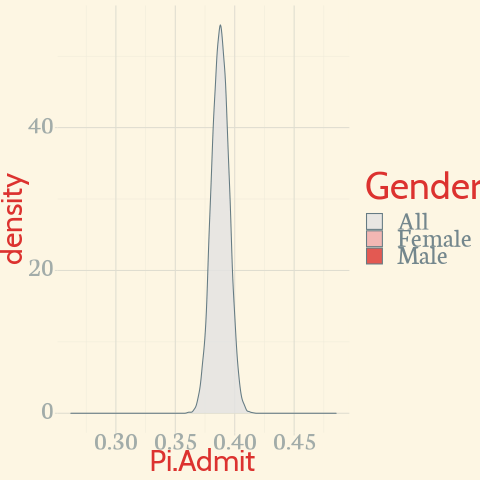

# How do we learn from data?


--

.center[]

--

It is probably better posed as, what can we learn from data?

```{r setup, include=FALSE}
library(gganimate)
options(htmltools.dir.version = FALSE, servr.daemon = TRUE)
options(gganimate.dev_args = list(width = 800, height = 600))
knitr::opts_chunk$set(warning=FALSE, message=FALSE, fig.height=6, fig.showtext =
TRUE, fig.retina=3)
library(DT)
```

```{r xaringan-themer, include=FALSE}
library(xaringanthemer); library(kableExtra); library(tidyverse)
style_mono_dark(
#style_solarized_light(
#style_duo(primary_color = "#371142", header_color = "#ffffff",
#          secondary_color = "#1c5253", 
#          text_bold_color = "#FF00FF",
          link_color = "#F97B64",
          text_font_google   = google_font("EB Garamond"),
          code_font_google   = google_font("Fira Mono")
)
```

```{css, echo = FALSE, include=FALSE}
.remark-slide-content p, il, ol, li {
  font-size: 36px;
  padding: 8px 32px 8px 32px;
}
code.r{
  font-size: 24px;
}
pre {
  font-size: 28px
}
.red { 
  color: red 
}
.green { 
  color: green 
}
```

---

# The Big Idea

## **Inference**

In the most basic form, learning something about data that we do not have from data that we do.  In the jargon of statistics, we characterize the probability distribution of some feature of the population of interest from a sample drawn randomly from that population.  

--

**Describe some key feature with appropriate uncertainty derived from a sample of data.**

--

**Plan studies of adequate size to assess key probabilities of interest.**

--

**Compare key probabilities across two groups.**

---
# Inference for Data

Of two forms:

1. Binary/Qualitative

--

2. Quantitative

--

We will focus on the former.

---
## Qualitative: The Binomial

Is entirely defined by two parameters, $n$ -- the number of subjects -- and $\pi$ -- the probability of a positive response.  The probability of exactly $x$ positive responses is given by:

$$ Pr(X = x | \pi, n) = {n \choose x} \pi^x (1-\pi)^{n-x} $$

The binomial is the `canonical` distribution for binary outcomes.  *Assuming all $n$ subjects are alike and the outcome occurs with $\pi$ probability*,<sup>1</sup> then we must have a sample from a binomial. 

Two key features:
1. Expectation: $n \cdot \pi$ or number of subjects times probability.
2. Variance is $n \cdot \pi \cdot (1 - \pi)$ and standard deviation is $\sqrt{n \cdot \pi \cdot (1 - \pi)}$.

--

Now let's grab some data and frame a question.

.footnote[<sup>1</sup> **If this does not hold, we will seek the homogenous groups in which it does.**]

---
## Berkeley Admissions  
  
What is the probability of being admitted to UC Berkeley Graduate School?<sup>2</sup>  
  
--
  
I have three variables: Admitted or not, Gender, and Department applied to.  
<span style="color: yellow;">Admission is the key.</span>

```{r}
library(janitor)
UCBTab <- data.frame(UCBAdmissions) %>% reshape::untable(., .$Freq) %>% select(-Freq) 
UCBTab %>% tabyl(Admit)  # Could also use prop.table(table(UCBTab$Admit))
```

The proportion is denoted as $\hat{p}$.  We can also do this with *table*.

.footnote[<sup>2</sup> **We probably think this depends on a bunch of applicant specific features but we will put that to the side for now.**]

---
class:inverse

```{r, eval=require('DT')}
UCBTab %>% DT::datatable(.,fillContainer = FALSE, options = list(pageLength = 8), rownames=FALSE)
```


---
## A Visual

```{r, fig.height = 5}
UCBTab %>% ggplot(.) + aes(x = Gender, fill = Admit) + geom_bar() + theme_xaringan() + scale_xaringan_fill_discrete()
```

---

# The Idea

Suppose we want to know $\pi(Admit)$ -- the probability of being admitted -- with 90% probability.  We want to take the data that we saw and use it to **infer** the likely values of $\pi(Admit)$.  

--

## Three interchangeable methods

1. Resampling/Simulation

--

2. Exact binomial computation

--

3. A normal approximation


---
## Method 1: Resampling

**Suppose I have 4526 chips with 1755 <span style="color: green;">green</span> and 2771 <span style="color: red;">red</span>.**  

--

I toss them all on the floor

--

and pick them up, one at a time, 

--

record the value (<span style="color: green;">green</span>/<span style="color: red;">red</span>), 
--

put the chip back,  
*[NB: I put it back to avoid getting exactly the same `sample` every time.]*

--

and repeat 4526 times.  

--

**Each count of <span style="color: green;">green chips</span> as a proportion of 4526 total chips constitutes an estimate of the probability of Admit.**

--

I wrote a little program to do just this -- `ResampleProps`.  
```
remotes::install_github("robertwwalker/ResampleProps")
```
---
class: inverse
# Resampling Result

```{r}
library(ResampleProps)
RSMP <- ResampleProp(UCBTab$Admit, k = 10000, tab.col = 1) %>% data.frame(Pi.Admit=., Gender=as.character("All"), frameN = 1) 
quantile(RSMP$Pi.Admit, probs = c(0.05,0.95))
```

What is our estimate of $\pi$ with 90% confidence?   

*The probability of admission ranges from `r quantile(RSMP$Pi.Admit, probs = c(0.05,0.95))[[1]]` to `r quantile(RSMP$Pi.Admit, probs = c(0.05,0.95))[[2]]`.*

---
# A Plot

```{r, fig.height= 5}
library(ggthemes)
RSMP %>%  ggplot(., aes(x=Pi.Admit)) + geom_density(outline.type = "upper", color="maroon") +labs(x=expression(pi)) + theme_minimal() + theme_xaringan()
```


---
## Another Way: Exact binomial

That last procedure is correct but it is overkill.

1. With probability of 0.05, how small could $\pi$ be to have gotten `r table(UCBTab$Admit)[[1]]` of `r sum(table(UCBTab$Admit))` or more?  

2. With probability 0.95, how big could $\pi$ be to have gotten  fewer than `r table(UCBTab$Admit)[[1]]` of `r sum(table(UCBTab$Admit))`?

```{r}
table(UCBTab$Admit)
```

--

**`binom.test` does exactly this.**

---
class: inverse
## binom.test()

```{r}
binom.test(1755, 1755+2771, conf.level=0.9)
Plot.Me <- binom.test(1755, 1755+2771, conf.level=0.9)$conf.int %>% data.frame()
```

**With 90% probability, now often referred to as 90% confidence to avoid using the word probability twice, the probability of being admitted ranges between 0.3758 and 0.3998.**

---
class: inverse
## Illustrating the Binomial

```{r}
binom.test(1755, 1755+2771, conf.level=0.9)
c(pbinom(1755, 1755+2771, 0.3998340), pbinom(1754, 1755+2771, 0.3757924))
```

---

```{r, fig.width=10}
Binomial.Search <- data.frame(x=seq(0.33,0.43, by=0.001)) %>% mutate(Too.Low = pbinom(1755, 1755+2771, x), Too.High = 1-pbinom(1754, 1755+2771, x))
Binomial.Search %>% pivot_longer(cols=c(Too.Low,Too.High)) %>% ggplot(., aes(x=x, y=value, color=name)) + geom_line() + geom_hline(aes(yintercept=0.05)) + geom_hline(aes(yintercept=0.95))  + geom_vline(data=Plot.Me, aes(xintercept=.), linetype=3) + labs(title="Using the Binomial to Search", color="Greater/Lesser", x=expression(pi), y="Probability") + theme_xaringan() + scale_xaringan_color_discrete()
```

---
## A Third Way: The normal approximation

As long as $n$ and $\pi$ are sufficiently large, we can approximate this with a normal distribution.  **This will also prove handy for a related reason.**  

As long as $n*\pi$ > 10, we can write that a standard normal $z$ describes the distribution of $\pi$, given $n$ -- the sample size and $\hat{p}$ -- the proportion of yes's/true's in the sample.

$$ Pr(\pi) = \hat{p} \pm z \cdot \left( \sqrt{\frac{\hat{p}*(1-\hat{p})}{n}} \right) $$

$R$ implements this in `prop.test`.  By default, R implements a modified version that corrects for discreteness/continuity.  To get the above formula exactly, `prop.test(table, correct=FALSE)`.

---
class: inverse

# The normal approximation

```{r}
# prop.test(table(UCBTab$Admit), conf.level = 0.9)
# (0.3877596 - 0.5)/(sqrt(0.5^2 / 4526))
prop.test(table(UCBTab$Admit), conf.level = 0.9, correct=FALSE)
```

$R$ reports the result as $z^2$ not $z$ which is $\chi^2$ not normal; we can obtain the $z$ by taking a square root.

This approximation yields an estimate of $\pi$, with 90% confidence, that ranges between `r prop.test(table(UCBTab$Admit), conf.level = 0.9)$conf.int[[1]]` and `r prop.test(table(UCBTab$Admit), conf.level = 0.9)$conf.int[[2]]`.

---
# A Cool Consequence of Normal

The formal equation defines:

$$ z = \frac{\hat{p} - \pi}{\sqrt{\frac{\pi(1-\pi)}{n}}} $$

Some language:
1. Margin of error is $\hat{p} - \pi$.  [MOE]
2. Confidence: the probability coverage given z [two-sided].
3. We need a guess at the true $\pi$ because variance/std. dev. depend on $\pi$.  0.5 is common because it maximizes the variance; we will have enough no matter what the true value.

Algebra allows us to solve for $n$.

$$ n = \frac{z^2 \cdot \pi(1-\pi)}{(\hat{p} - \pi)^2} $$

---
class:inverse
### Example

Estimate the probability of supporting an initiative to within 0.03 with 95% confidence.  Assume that the probability is 0.5 [it maximizes the variance and renders a conservative estimate -- an upper bound on the sample size]

```{r}
Sample.Size <- function(MOE, B.pi=0.5, Conf.lev=0.95) { 
  My.n <- ((qnorm((1-Conf.lev)/2)^2)*(B.pi*(1-B.pi))) / MOE^2 
  Necessary.sample <- ceiling(My.n) 
  return(Necessary.sample) 
}
Sample.Size(MOE=0.03, B.pi=0.5, Conf.lev = 0.95)
```

**I need 1068 people to estimate support to within plus or minus 0.03 with 95% confidence.**

---
class: inverse
### In the Real World


```{r, echo=FALSE, out.height = "300px", out.width="1000px"}
y1 <- "https://i.imgur.com/Fp2nuNN.png"
download.file(y1, './y1.png')
knitr::include_graphics("./y1.png")
```

[A real poll](https://navigatorresearch.org/wp-content/uploads/2020/04/Navigator-Daily-Tracker-Topline-F04.13.20.pdf).  They do not have quite enough for a 3% margin of error.  But 1006 is enough for a 3.1 percent margin of error...

```{r}
Sample.Size(MOE=0.031, B.pi=0.5, Conf.lev = 0.95)
```

---
# Back to the Story

What is our estimate of $\pi$ with 90% confidence?  

**The probability of admission ranges from `r quantile(RSMP$Pi.Admit, probs = c(0.05,0.95))[[1]]` to `r quantile(RSMP$Pi.Admit, probs = c(0.05,0.95))[[2]]`.**

Does this depend on whether the applicant is Male or Female?

---
# Analysis by Group

```{r}
library(janitor); UCBTab %>% tabyl(Gender,Admit) %>% adorn_totals("col")
UCBTF <- UCBTab %>% filter(Gender=="Female")
UCBTF.Pi <- ResampleProp(UCBTF$Admit, k = 10000) %>%  data.frame(Pi.Admit=., Gender=as.character("Female"), frameN=2) # Estimates for females
UCBTM <- UCBTab %>% filter(Gender=="Male")
UCBTM.Pi <- ResampleProp(UCBTM$Admit, k = 10000) %>%  data.frame(Pi.Admit=., Gender = as.character("Male"), frameN = 2)  # Estimates for males
```

---
class:inverse
# Binomial Result: Males

```{r BinomMale}
binom.test(1198,2691, conf.level = 0.9)
```

The probability of being admitted, conditional on being Male, ranges from 0.43 to 0.46 with 90% confidence.

---

## The Thought Experiment: Male

```{r BMPlot}
UCBTM.Pi %>%  ggplot(., aes(x=Pi.Admit)) + geom_density(color="maroon") + labs(x=expression(pi)) + theme_xaringan()
```


---
class: inverse
## Binomial Result: Females

```{r BinomF}
binom.test(557,1835, conf.level = 0.9)
```

The probability of being of Admitted, given a Female, ranges from 0.286 to 0.322 with 90% confidence.

---
## The Thought Experiment: Female

```{r BFPlot}
UCBTF.Pi %>%  ggplot(., aes(x=Pi.Admit)) + geom_density(color="maroon") + labs(x=expression(pi)) + theme_xaringan()
```

---
# Succinctly

Female: from 0.286 to 0.322  
Male: from 0.43 to 0.46  
All: from 0.3758 to 0.3998  

```{r patch1, fig.width=12, echo=FALSE}
library(patchwork)
ggplot(UCBTab) +aes(x = Gender, fill = Admit) + geom_bar(position = "dodge") + scale_xaringan_fill_discrete() + theme_xaringan() + ggplot(UCBTab) +aes(x = Gender, fill = Admit) + geom_bar(position = "fill") + scale_xaringan_fill_discrete() + theme_xaringan() + guides(fill=FALSE)
```

---
class: inverse

# A Key Visual

```{r, warning=FALSE}
UCB.Pi <- bind_rows(UCBTF.Pi, UCBTM.Pi)
UCB.Pi %>% ggplot(., aes(x=Gender, y=Pi.Admit, fill=Gender)) + geom_violin() + geom_label(aes(x=1.5, y=0.375), label="Too small to be male \n Too large to be female?", size=14, fill="black", color="white", inherit.aes = FALSE) + guides(size=FALSE) + scale_xaringan_fill_discrete() + theme_xaringan()
```

---
class: inverse

```{r GGAnim, eval=FALSE, warning=FALSE, message=FALSE, results='hide', gganimate = list(fig.height="600px", fig.width="800px")}
UCB.Pi <- bind_rows(UCBTF.Pi, UCBTM.Pi, RSMP)
UCB.Pi %>% ggplot(., aes(x=Pi.Admit, fill=Gender)) + geom_density(alpha=0.8) + theme_minimal() + scale_fill_viridis_d() + transition_states(frameN, state_length = 40, transition_length = 20) + enter_fade() + exit_fade() -> SaveAnim
animate(SaveAnim, device = "svg")
anim_save(filename="./Anim1.gif")
```




---
# Can We Measure the Difference?

.pull-left[
How much more likely are Males to be admitted when compared to Females?

**We can take the difference in our estimates for Male and Female.**

```{r Diff, tidy=FALSE}
UCB.Diff <- UCB.Pi %>% filter(frameN != 1) %>% select(Pi.Admit, Gender) %>% mutate(obs = rep(seq(1:10000),2)) %>% pivot_wider(., id_cols = obs, values_from=Pi.Admit, names_from=Gender) %>% mutate(Diff = Male - Female)
quantile(UCB.Diff$Diff, probs=c(0.05,0.95))
```

```{r GGP1, eval=FALSE}
ggplot(UCB.Diff) + aes(x=Diff) + geom_density() + labs(title="Difference in Probability of Admission", subtitle="[Male - Female]") + theme_xaringan()
```
]
.pull-right[
```{r, echo=FALSE}
ggplot(UCB.Diff) + aes(x=Diff) + geom_density() + labs(title="Difference in Probability of Admission", subtitle="[Male - Female]") + theme_xaringan()
```
]

---
class: inverse

## Or Use the Normal Approximation

```{r}
prop.test(table(UCBTab$Gender,UCBTab$Admit), conf.level=0.9)
```

With 90% confidence, a Female is 0.1175 to 0.1658 less likely to be admitted.
